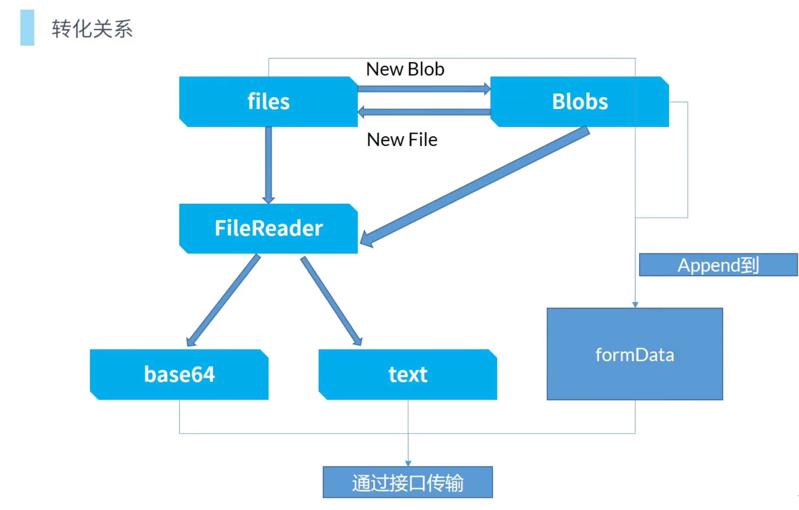

# 上传




## FileList

files是FileList类型而不是`File[]`

FileList是一个类数组，

| 特性                              | `FileList` | `Array` |
| --------------------------------- | ---------- | ------- |
| 可否 `forEach` / `map` / `filter` | ❌          | ✅       |
| 可否使用扩展运算符 `[...files]`   | ✅          | ✅       |
| 可否直接 `push` / `pop`           | ❌          | ✅       |
| 类型推断                          | `FileList` | `any[]` |

`FileList` 不是数组，用 `Array.from` 转成真数组，**类型、链式调用、兼容性** 都更稳妥：

```ts
const files = Array.from(fileInput.value?.files ?? []);
```


## FormData格式传输

File对象和Blob对象都无法直接传输给后端，需要使用formData传输

```ts
import axios from "axios"

const fd = new FormData()
fd.append("username", "alice")
fd.append("file", new File(["hello"], "hello.txt", { type: "text/plain" }))

await axios.post("/upload", fd)

```

axios 会自动识别 `FormData`，并设置：

- `Content-Type: multipart/form-data`（带 boundary）
- 把 `FormData` 序列化成 multipart/form-data 格式上传


## base64格式传输


## 切片上传

```ts
<template>
  <div>
    <input type="file" @change="handleFileChange" />
    <div v-if="progress > 0">上传进度：{{ progress }}%</div>
  </div>
</template>

<script setup lang="ts">
import { ref } from 'vue'
import axios from 'axios'

const CHUNK_SIZE = 1024 * 1024 // 每片 1MB

const progress = ref(0)

const handleFileChange = async (event: Event) => {
  const file = (event.target as HTMLInputElement).files?.[0]
  if (!file) return

  const totalChunks = Math.ceil(file.size / CHUNK_SIZE)
  
  for (let i = 0; i < totalChunks; i++) {
    const start = i * CHUNK_SIZE
    const end = Math.min(file.size, start + CHUNK_SIZE)
    const chunk = file.slice(start, end)

    const formData = new FormData()
    formData.append('chunk', chunk)
    formData.append('fileName', file.name)
    formData.append('index', i.toString())
    formData.append('total', totalChunks.toString())

    await axios.post('/upload/chunk', formData)

    // 更新进度
    progress.value = Math.round(((i + 1) / totalChunks) * 100)
  }

  // 通知服务器合并
  await axios.post('/upload/merge', { fileName: file.name, totalChunks })
  alert('上传完成')
}
</script>

```


## 断点续传

```ts
<template>
  <div>
    <input type="file" @change="handleFileChange" />
    <div v-if="progress > 0">上传进度：{{ progress }}%</div>
  </div>
</template>

<script setup lang="ts">
import { ref } from 'vue'
import axios from 'axios'

const CHUNK_SIZE = 1024 * 1024 // 每片 1MB
const progress = ref(0)

// 本地记录已上传的片索引
const uploadedChunks = ref<Set<number>>(new Set())

const handleFileChange = async (event: Event) => {
  const file = (event.target as HTMLInputElement).files?.[0]
  if (!file) return

  const totalChunks = Math.ceil(file.size / CHUNK_SIZE)

  // 1️⃣ 查询服务器已上传的片索引
  const { data: serverUploaded } = await axios.get('/upload/status', {
    params: { fileName: file.name }
  })
  uploadedChunks.value = new Set(serverUploaded) // 假设服务器返回已上传的片索引数组

  // 2️⃣ 上传未完成的片
  for (let i = 0; i < totalChunks; i++) {
    if (uploadedChunks.value.has(i)) {
      // 跳过已上传的片
      progress.value = Math.round(((i + 1) / totalChunks) * 100)
      continue
    }

    const start = i * CHUNK_SIZE
    const end = Math.min(file.size, start + CHUNK_SIZE)
    const chunk = file.slice(start, end)

    const formData = new FormData()
    formData.append('chunk', chunk)
    formData.append('fileName', file.name)
    formData.append('index', i.toString())
    formData.append('total', totalChunks.toString())

    await axios.post('/upload/chunk', formData)

    progress.value = Math.round(((i + 1) / totalChunks) * 100)
  }

  // 3️⃣ 通知服务器合并
  await axios.post('/upload/merge', { fileName: file.name, totalChunks })
  alert('上传完成')
}
</script>

```


