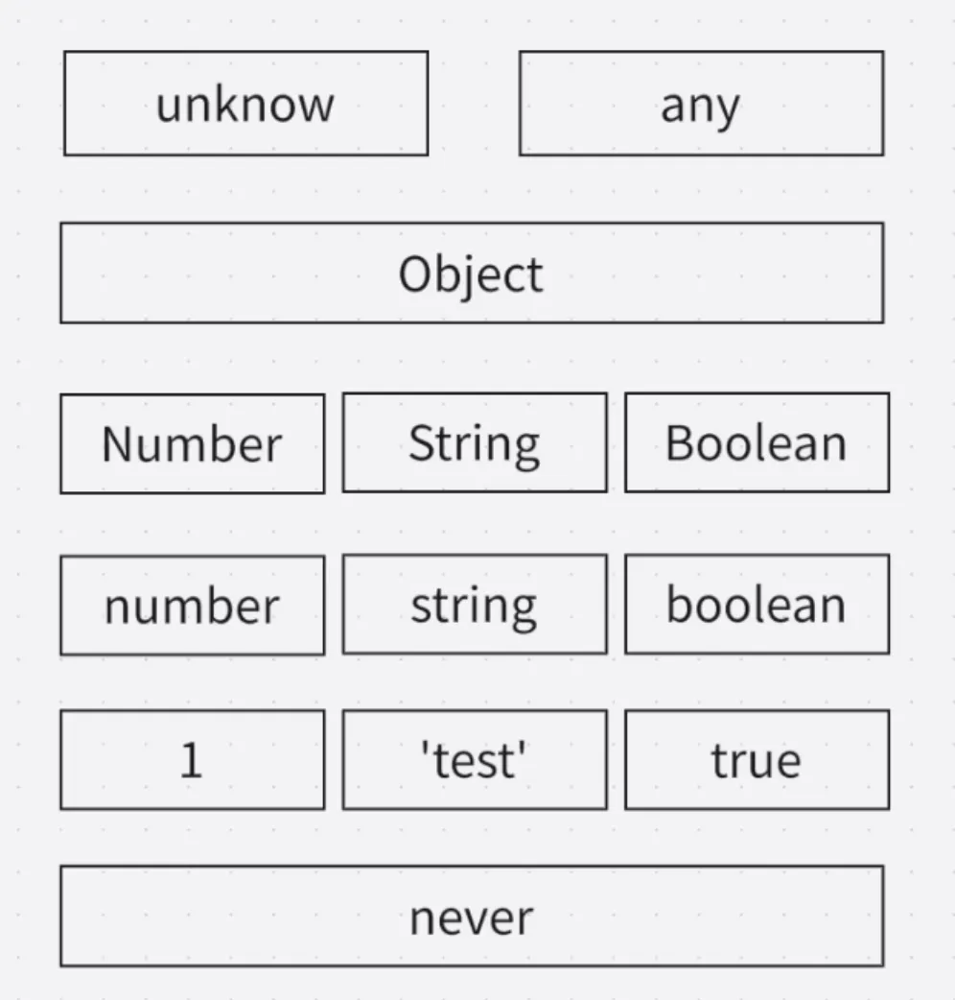

# 类型运算



## extends

```ts
A extends B
```

- 如果A继承自B，则表达式为真

  ```ts
    interface Person {
      name: string;
      age: number;
    }

    interface Employee extends Person {
      jobTitle: string;
    }

    type Test2 = Employee extends Person ? true : false; // true

  ```

- 如果 A可以赋值B，则表达式为真

  ```ts
  type A = string;
  type B = string | number;
  
  type Test1 = A extends B ? true : false; // true
  string extends never //false
  
  //string 类型确实继承了 { length: number } 类型，因为所有的字符串都有一个 length 属性，并且该属性的类型是 number。
  type Test = string extends { length: number } ? true : false;  // true
  
  ```
  
  

## typeof

在TS环境中`typeof` 用于获取变量或表达式的类型并告诉编译器。

```ts
const obj = { name: "Alice", age: 25 };
type ObjType = typeof obj;  // 编译器知道了ObjType 是 { name: string, age: number }
console.log(ObjType)//object，不影响实际运行
```


## keyof

`keyof` 用于获取**对象类型**的 **键**，即返回一个联合类型，包含对象所有属性的名称。类型将会告诉编译器

```ts
const obj = { name: "Alice", age: 25 };
type ObjKeys = keyof typeof obj;  // 编译器知道了ObjKeys 是 "name" | "age"

```

```ts
const person = { name: "Alice", age: 25, job: "Engineer" };
type PersonKeys = keyof typeof person;  // 编译器知道了PersonKeys 是 "name" | "age" | "job"

```

