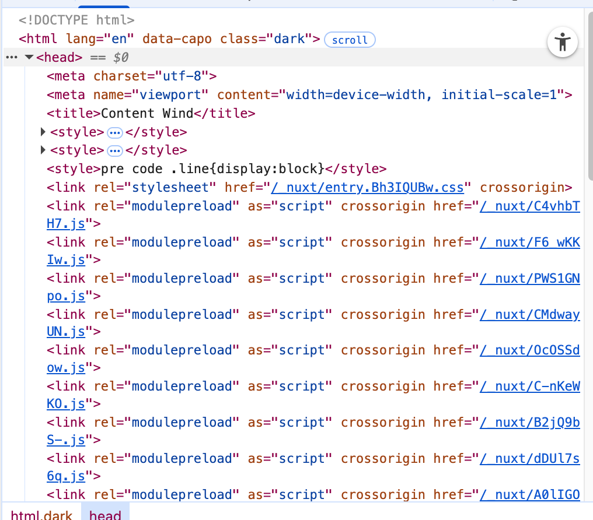

# SEO与元数据

元数据指的是HTML中head标签内的各种数据



## Nuxt配置

在`nuxt.config.ts` 中设置一些不会变化的标签，例如您的网站默认标题、语言和 favicon

``` ts [nuxt.config.ts]
export default defineNuxtConfig({
  app: {
    head: {
      title: 'Nuxt', // 默认备用标题
      htmlAttrs: {
        lang: 'en',
      },
      link: [
        { rel: 'icon', type: 'image/x-icon', href: '/favicon.ico' },
      ]
    }
  }
})
```

您还可以提供以下 [类型](https://nuxt.zhcndoc.com/docs/4.x/getting-started/seo-meta#types) 中列出的任何键。例如`link`，`script`，`style`

:::warning

此方法不允许您提供响应式数据。我们建议在 `app.vue` 中使用 `useHead()`。

:::

## 默认标签

一些标签是 Nuxt 默认提供的，以确保您的网站开箱即用的良好表现。

- `viewport`: `width=device-width, initial-scale=1`
- `charset`: `utf-8`

## useHead

[`useHead`](https://nuxt.zhcndoc.com/docs/4.x/api/composables/use-head) 组合函数支持响应式输入，使您可以以编程方式管理您的 head 标签。

:::code-group

```vue [app.vue]
<script setup lang="ts">
useHead({
  title: 'My App',
  meta: [
    { name: 'description', content: 'My amazing site.' }
  ],
  bodyAttrs: {
    class: 'test'
  },
  script: [ { innerHTML: 'console.log(\'Hello world\')' } ]
})
</script>

```

```html [渲染结果]
<html>
  <head>
    <title>My App</title>
    <meta name="description" content="My amazing site.">
    <script>console.log('Hello world')</script>
  </head>
  <body class="test">
    <!-- 应用内容 -->
  </body>
</html>

```

:::

### titleTemplate

您可以使用 `titleTemplate` 选项提供一个动态模板，以自定义您的网站标题。例如，您可以将网站名称添加到每个页面的标题中。

titleTemplate接受一个参数title，他指的是当前页面中生效的title值

通常我们会在 **布局** 里写一个全局 `titleTemplate`，然后在 **页面**里只写 `title`：

:::code-group

```vue [layouts/default.vue]
<script setup lang="ts">
useHead({
  titleTemplate: (title) => title ? `${title} - NuxtSite` : 'NuxtSite'
})
</script>

<template>
  <slot />
</template>

```


```vue [pages/index.vue]
<script setup lang="ts">
useHead({ title: '首页' })
</script>

```


```html [渲染结果]
<title>首页 - NuxtSite</title>
```


## 组件

然在所有情况下都推荐使用 [`useHead`](https://nuxt.zhcndoc.com/docs/4.x/api/composables/use-head)，但您可能更喜欢使用组件在模板中定义您的 head 标签。

Nuxt 提供了以下组件用于此目的：`<Title>`、`<Base>`、`<NoScript>`、`<Style>`、`<Meta>`、`<Link>`、`<Body>`、`<Html>` 和 `<Head>`。请注意这些组件的大小写，以确保我们不使用无效的原生 HTML 标签。

::: code-group 

```vue [app.vue]
<script setup lang="ts">
const title = ref('Hello World')
</script>

<template>
  <div>
    <Head>
      <Title>{{ title }}</Title>
      <Meta name="description" :content="title" />
      <Style>
      body { background-color: green; }
      </Style>
    </Head>

    <h1>{{ title }}</h1>
  </div>
</template>

```

```html
<html>
  <head>
    <title>Hello World</title>
    <meta name="description" content="Hello World">
    <style>
      body { background-color: green; }
    </style>
  </head>
  <body>
    <div>
      <h1>Hello World</h1>
    </div>
  </body>
</html>

```

:::

## definePageMeta

 **`definePageMeta`** 是 Nuxt3 提供的一个编译时宏，用来在页面组件里声明 **页面元信息**（这是通过宏在构建时提取的，因此无法动态设置）。

`definePageMeta` 主要用来配置：

- **路由相关信息**（比如 `middleware`、`layout`）
- **head 元信息**（比如 `title`、`meta`）
- **页面缓存/过渡效果**

它只在 **页面组件 (`pages/xxx.vue`)** 中生效。

```vue
<script setup lang="ts">
definePageMeta({
  title: '关于我们',
  meta: [
    { name: 'description', content: '这是关于我们页面的描述' }
  ]
})
</script>

```


## 元数据优先级

页面级 > 布局级 > 插件/全局

## SEO

基础SEO标签：

```html
<title>我的网站</title>
<meta name="description" content="这是我的网站简介，用一句话说明亮点。">
<meta name="keywords" content="关键词1,关键词2,关键词3">

```

微信专用：

```js
wx.updateAppMessageShareData({
  title: '我的网站', // 分享标题
  desc: '这是我的网站简介', // 分享描述
  link: 'https://example.com', // 分享链接
  imgUrl: 'https://example.com/cover.png', // 分享图标
})
```

百度搜索

百度会抓取 `<title>`、`<meta name="description">`

