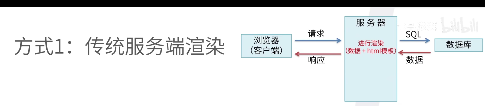
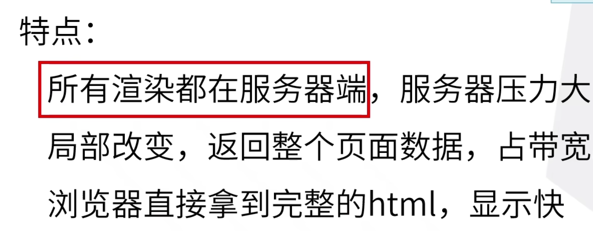
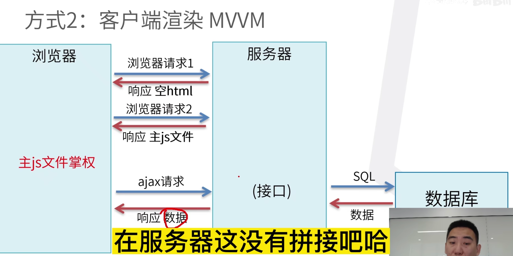
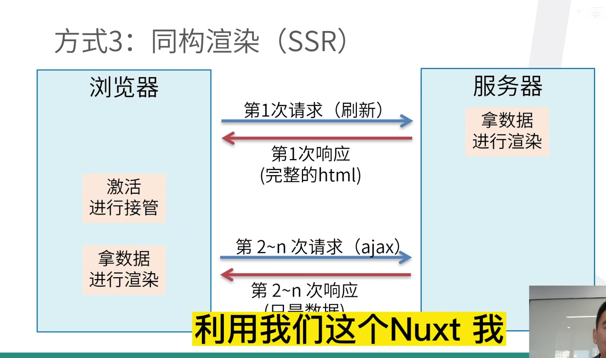

##  服务端渲染

## 客户端渲染（CSR）

浏览器请求页面 → 服务器只返回一个基本的 HTML：index.html（通常只有一个 `div#app` 容器 + JS 引用） → 浏览器下载并执行 JavaScript → JS 在客户端渲染出页面内容 → 用户看到完整页面。

图示：

index.html->获取主js文件->ajax

### 优点

**前后端分离**
 前端只管渲染和交互，后端只管提供数据接口，开发效率高。

**交互体验好**
 页面切换时通常不需要刷新整个页面，只需更新局部（SPA 单页应用）。

### 缺点

**首屏加载慢**
 第一次进入页面时，浏览器必须先下载 JS，再执行 JS 才能看到内容，可能出现“白屏”。

**SEO 不友好**
 搜索引擎可能无法很好地抓取动态生成的内容（尽管现在 Google 对 CSR 的支持更好了）。

**性能依赖客户端**
 用户设备性能较差时，渲染速度会变慢。

## 同构渲染SSR

### 优点

**更快的首屏渲染**
 因为服务端已经生成了完整的 HTML，浏览器不需要等待 JS 执行就能直接显示页面内容。

**更好的 SEO**

 搜索引擎爬虫更容易抓取完整内容（特别是需要被搜索引擎收录的页面）。

 搜索引擎爬虫可以直接看到服务端渲染的完整 HTML 内容，而不需要执行 JavaScript，这非常有利于内容索引。

**更好的用户体验**
 对网络差或设备性能较差的用户更友好。

### 缺点

**服务器压力更大**
 每个请求都要在服务器渲染一次页面，计算量比 CSR 高。

**开发复杂度提升**
 前端和后端要一起协作，处理同构（代码既能在服务端运行，也能在客户端运行）。

**缓存和状态管理复杂**
 必须考虑如何处理服务端和客户端的状态同步。