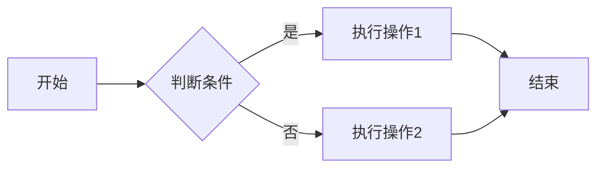

# mermaid


```mermaid
flowchart LR
    A[开始] --> B{判断条件}
    B -->|是| C[执行操作1]
    B -->|否| D[执行操作2]
    C --> E[结束]
    D --> E
```

- LR：流程图从左到右
- TB：流程图从上到下

```
flowchart LR
```

- `A[文本]` → 方框

- `B{文本}` → 菱形（条件判断）

- 箭头 `-->` 表示流程方向

- 可以加 `|标签|` 表示分支条件