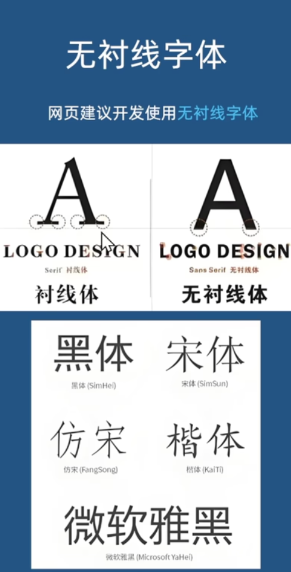
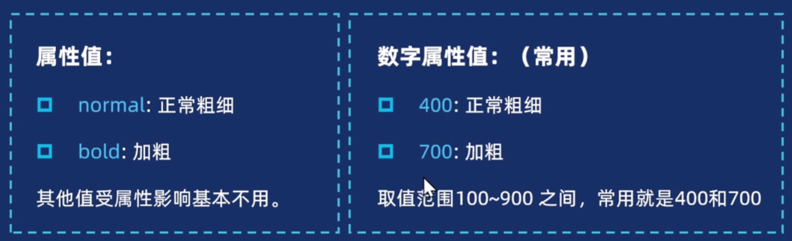
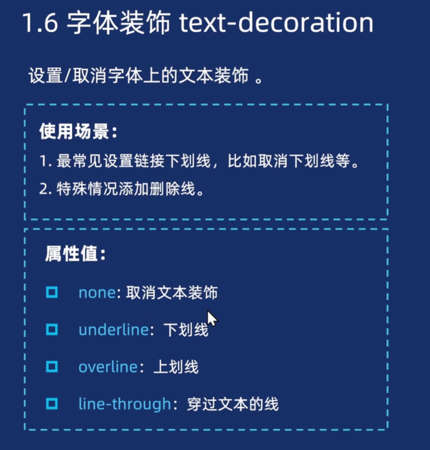

# 文本样式

::: warning
文本是无法直接通过 CSS 更改样式的，必须要用适合的标签包裹，本质是修改标签样式，里面文字跟随样式变化
:::

## 字体样式

### color

字体颜色

### font-family

字体族



## font-size

字体大小
::: tip 设计规范
不同的浏览器的默认字体的大小不同，因此建议在`body`中声明网页使用的字体大小
:::

## font-style

常用于将`<em>`和 i 标签自带的倾斜关闭

```css
em {
  font-style: normal;
}
```

## font-weight





## text-decoration



## 总结

## 文本布局
