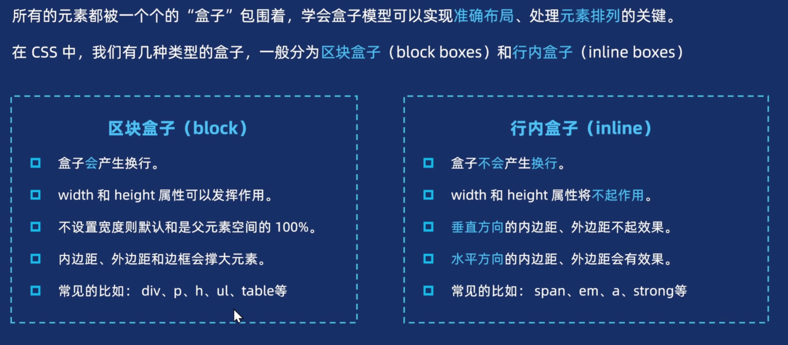

# 边框




## border

border由三部分组成：

1. **边框宽度（border-width）**
2. **边框样式（border-style）**
3. **边框颜色（border-color）**

```css
border: 2px solid red;

```

border相关属性：

| 属性                           | 说明           | 示例                           |
| ------------------------------ | -------------- | ------------------------------ |
| `border-width`                 | 边框宽度       | `border-width: 2px;`           |
| `border-style`                 | 边框样式       | `border-style: solid;`         |
| `border-color`                 | 边框颜色       | `border-color: red;`           |
| `border-top/bottom/left/right` | 单独设置某条边 | `border-top: 1px dashed blue;` |
| `border-radius`                | 圆角边框       | `border-radius: 10px;`         |

通常会使用`border` +`border-top/bottom/left/right 去实现任意的边框样式`

```css
border: 2px solid red;
boder-top: 2px solid yellow;
```

## border-width

控制边框的宽度

```css
border-width: 0 2px 2px 0;
```

`border-width`为0时，边框将不展示

## border-style

`border-style`的常见可选值：

| 值       | 说明                 |
| -------- | -------------------- |
| `none`   | 无边框（默认）       |
| `solid`  | 实线                 |
| `dashed` | 虚线                 |
| `dotted` | 点线                 |


