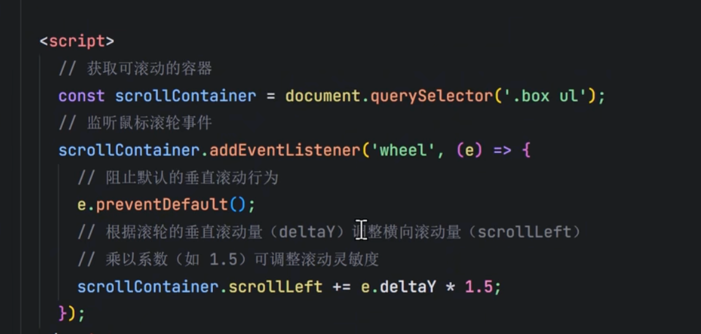

# 溢出


## 隐藏滚动条

- Firefox：

```css
  scrollbar-width: none; /* Firefox */
```

- Chrome、Safari：

```css
.scroll-container::-webkit-scrollbar {
  display: none; /* Chrome, Safari */
}
```



## scroll-behavior

`scroll-behavior` 是一个用于**控制滚动行为的 CSS 属性**，可以让滚动（例如点击锚点、调用 JS 滚动方法）变得“平滑”或“瞬间跳转”。

```css
scroll-behavior: auto | smooth;
```


| 值       | 效果       | 说明           |
| -------- | ---------- | -------------- |
| `auto`   | ⚡ 立即滚动 | 默认值，无动画 |
| `smooth` | 🧭 平滑滚动 | 有过渡动画效果 |


- 全局平滑滚动

```css
html {
  scroll-behavior: smooth;
}
```

- 只让某个容器平滑滚动

```css
.scroll-box {
  overflow: auto;
  scroll-behavior: smooth;
  height: 300px;
}

```

:::warning

1. 该属性仅影响 **编程触发** 的滚动（例如锚点跳转、`scrollTo()` 等），不会改变用户手动滚动的速度。

2. 如果你在某个容器上使用 `overflow: hidden;`，即使设置了 `scroll-behavior: smooth;`，也无法滚动。

:::