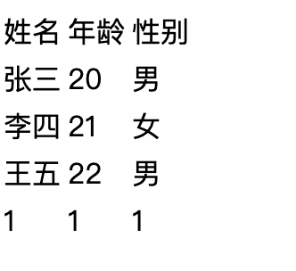
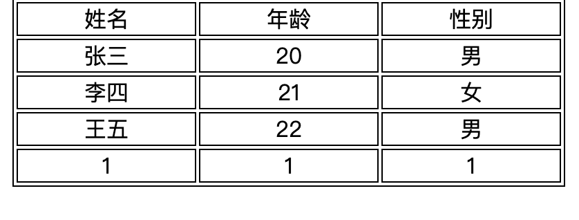
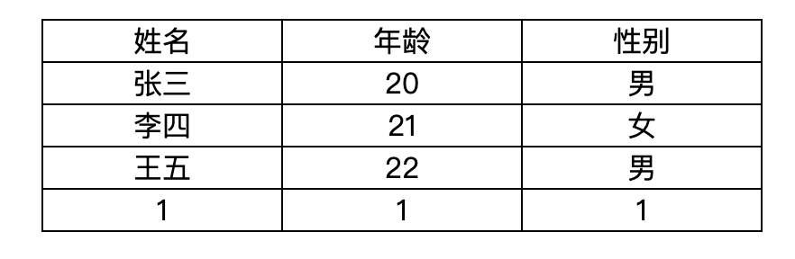

# 表格样式

## 默认表格行为

浏览器会根据 **表格布局算法** 来计算宽度和高度。

```css
table {
  display: table;
}
tr {
  display: table-row;
}
td {
  display: table-cell;
}
```

表格布局具有如下特点：

- 自动计算列宽；

- 单元格会对齐；

- 内容会影响整列宽度；

- 视觉上是“表格网格”。

- 单元格宽度由内容确定



::: warning

当你把表格设为 `display: block`：

```css
table {
  display: block;
}
```

浏览器会把它当作一个**普通块级元素**。这时内部的 `<tr>`、`<td>` **不再参与表格布局算法**。因此谨慎修改`display`
:::

## border-collapse

`border-collapse` 控制 **HTML 表格 `<table>` 的边框是否合并**。

- 背景引入

如果`table`和`td`同时添加边框，那么将会看到两个边框，但是我们实际可能只想看到一条边框





- 常见属性

| 值                 | 说明                                 | 示例效果                                             |
| ------------------ | ------------------------------------ | ---------------------------------------------------- |
| `collapse`         | **合并边框**，相邻单元格共用一条边框 | 表格边框看起来连在一起，像一条线                     |
| `separate`（默认） | **分离边框**，每个单元格有独立边框   | 表格边框之间有空隙，可通过 `border-spacing` 调整间距 |

- 常见场景：

消除表格边框

```css
table {
  border-collapse: collapse;
}
```

## 示例

:::code-group

```css
* {
  margin: 0;
  padding: 0;
}

table {
  width: 400px;
  border-collapse: collapse;
  margin: 0 auto;
  text-align: center;
}
/* 边框 */
table,
td {
  border: 1px solid #000;
}
/* 表头 */
table thead tr {
  background-color: skyblue;
  font-weight: bold;
}
/* 斑马纹 */
table tbody tr:nth-child(even) {
  background-color: gray;
}
/* 实现选择行高亮 */
table tbody tr:hover {
  background-color: yellow;
}
```

```html
<table>
  <thead>
    <tr>
      <td>姓名</td>
      <td>年龄</td>
      <td>性别</td>
    </tr>
  </thead>
  <tbody>
    <tr>
      <td>张三</td>
      <td>20</td>
      <td>男</td>
    </tr>
    <tr>
      <td>李四</td>
      <td>21</td>
      <td>女</td>
    </tr>
    <tr>
      <td>王五</td>
      <td>22</td>
      <td>男</td>
    </tr>
    <tr>
      <td>1</td>
      <td>1</td>
      <td>1</td>
    </tr>
  </tbody>
</table>
```

:::codegroup

[跳转到表格示例](/table.html)
