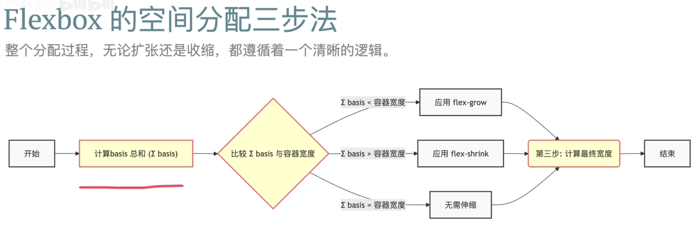
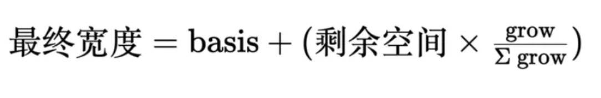
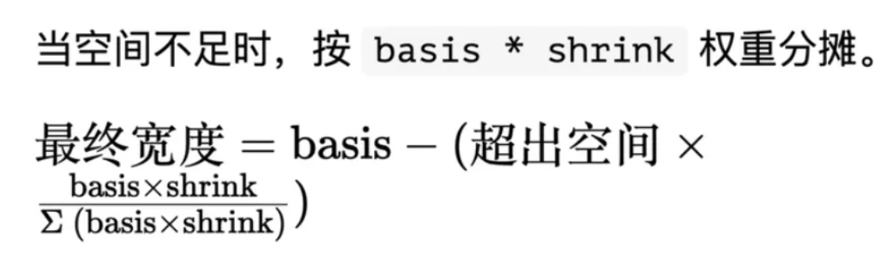

# 弹性盒本质


## 核心概念

```css
flex: <flex-grow> <flex-shrink> <flex-basis>;
```

| 写法         | 等价完整写法     | 含义                               |
| ------------ | ---------------- | ---------------------------------- |
| `flex: 1`    | `flex: 1 1 0`    | 均分剩余空间（常见用法）           |
| `flex: 2`    | `flex: 2 1 0`    | 放大比例是 2 倍                    |
| `flex: none` | `flex: 0 0 auto` | 不放大不缩小，固定大小             |
| `flex: auto` | `flex: 1 1 auto` | 可放大、可缩小，初始大小为自身宽度 |

- **flex-basis**

基准宽度，空间分配的计算起点

| 值             | 含义                                                | 示例                   |
| -------------- | --------------------------------------------------- | ---------------------- |
| `auto`         | 默认值，使用元素本身的大小（或 `width` / `height`） | 默认情况               |
| `0`            | 忽略自身大小，从 0 开始分配空间                     | `flex: 1 1 0` 常用写法 |
| `<length>`     | 固定大小（px、rem等）                               | `flex-basis: 200px;`   |
| `<percentage>` | 相对于父容器主轴尺寸的百分比                        | `flex-basis: 50%;`     |

flex-basis和width的关系：

| 情况                               | 哪个生效                                |
| ---------------------------------- | --------------------------------------- |
| 同时设置了 `width` 与 `flex-basis` | **`flex-basis` 优先生效**               |
| 只设置了 `width`                   | 相当于 `flex-basis: auto`，使用 `width` |
| 都没设置                           | 大小由内容决定                          |

- **flex-grow**

扩张因子：当容器有剩余空间时，决定如何瓜分这些空间

默认值：

```css
flex-grow: 0
```


- **flex-shrink**

收缩因子：当容器空间不足时，决定如何分摊超出的部分

默认值：

```css
flex-shrink: 1
```


## 空间分配



## 计算公式

### 扩展公式



```css
.a{
  flex:1 1 0;
}
.b{
  flex:2 1 auto;
}
.c{
  1 1 100px;
}
```


### 收缩公式



```css
.flex-container {
  display: flex;
  width: 400px;
}
.a{
  flex:1 1 300px;
}
.b{
  flex: 1 2 200px;
}
```

- 计算基准宽度

200px+300px=500px

- 计算超出的宽度

500px-400px=100px

- 计算收缩权重并分配

A权重=basis* shrink=300

B权重=basis* shrink=400

A最终宽度：300-100*300/700=257.143 

B最终宽度：200-100*400/700=142.857 
