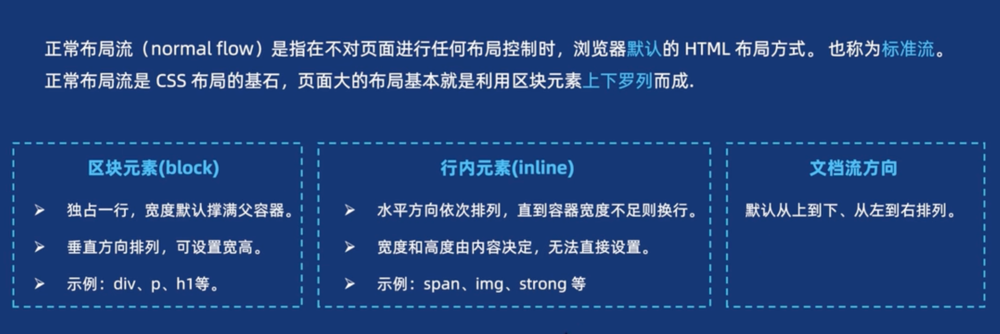
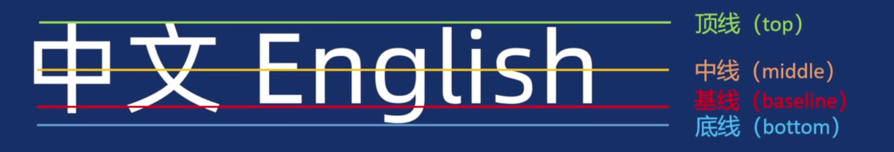

# 标准流


## 标准流




## display

行内元素是不支持设置大小的，我们可以设置display转为block

常用属性值：

| 值             | 含义       | 特点                 |
| -------------- | ---------- | -------------------- |
| `block`        | 块级元素   | 独占一行，可设置宽高 |
| `inline`       | 行内元素   | 不换行，不可设置宽高 |
| `inline-block` | 行内块     | 不换行 + 可设置宽高  |
| `none`         | 不显示元素 | 元素从文档流中移除   |

- 示例：

```css
div { display: block; }
span { display: inline; }
img { display: inline-block; }
.hidden { display: none; }

```

:::warning inline-block

行内块之间会存在空隙，这是因为html内换行导致的，我们可以设置父元素的`font-size:0`即可去除空隙


:::


## inline

行内元素在排版中存在用于对齐的基线



图片作为一个行内元素，他也是基于基线对齐的，因此每一张图片的下方都存在空白

解决方案：

- 转为块级元素
- 将`vertical-align`设置除基线对齐以外的其他方式即可