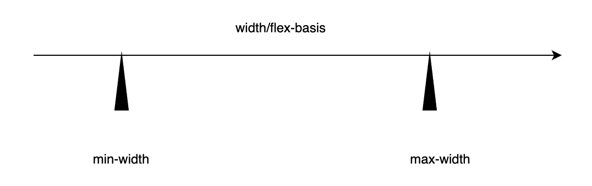

# 弹性限度

## min/max-width



| 属性         | 作用                             | 优先级      | 备注                           |
| ------------ | -------------------------------- | ----------- | ------------------------------ |
| `flex-basis` | 定义元素在主轴上的初始尺寸       | 高          | 优先于 `width`                 |
| `width`      | 元素的默认宽度（在主轴为水平时） | 中          | 当 `flex-basis: auto` 时才生效 |
| `min-width`  | 限制最小宽度                     | 高于 `flex` | 即使压缩也不会小于此值         |
| `max-width`  | 限制最大宽度                     | 高于 `flex` | 即使放大也不会超过此值         |

## 三栏式布局

### 基本布局

左右两栏宽度固定，中间一栏占据所有剩余空间


```vue
<!DOCTYPE html>
<html lang="en">
  <head>
    <meta charset="UTF-8" />
    <meta name="viewport" content="width=device-width, initial-scale=1.0" />
    <title>Document</title>
    <style>
      * {
        margin: 0;
        padding: 0;
      }
      .container {
        display: flex;
        height: 100vh;
      }
      .left,
      .right {
        width: 100px;
        flex-shrink: 0;
        background-color: yellowgreen;
      }
      .middle {
        flex: 1;
        max-width: 1000px;
        background-color: #f0f0f0;
      }
    </style>
  </head>
  <body>
    <div class="container">
      <div class="left">left</div>
      <div class="middle">middle</div>
      <div class="right">right</div>
    </div>
  </body>
</html>

```

当浏览器窗口调整至很小时，侧边栏将会收缩，因为`shrink`默认为1

### 禁止侧边栏收缩

- 解决方案1：

```css
.left,.right {
  width: 100px;
  flex-shrink:0;
}

```

- 解决方案2：

flexbox会尊重元素的最小宽度限制

```css
.left,.right {
  width: 100px;
  min-width:100px;
}
```

### 超宽屏优化

为内容区添加`max-width`即可解决弹性盒子过宽导致内容区过宽的问题

```css
.middle {
  max-width:1000px;
  flex: 1;
}
```

最终效果：

| 屏幕宽度 | middle 实际宽度 | container宽度 | 空白区域                    |
| -------- | --------------- | ------------- | --------------------------- |
| 800px    | 600px           | 800px         | 无                          |
| 1200px   | 1000px          | 1200px        | 无                          |
| 2000px   | 1000px          | 2000px        | 三栏居左，右侧出现800px空白 |

container宽度没有设置宽度，因此其宽度是父容器的100%
