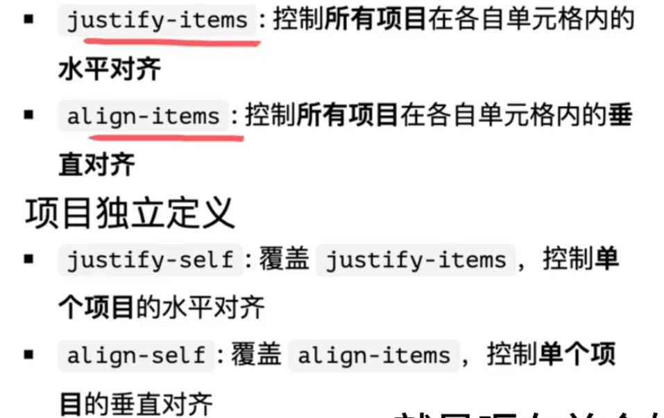

# 对齐

## 网格间距

使用gap告别`margin`的痛点

在 Grid 中，**网格间距** 是指「**轨道**之间的空隙」， 包括：

- **行间距（row-gap）**
- 列间距（column-gap）

1. 分开写：

```css
row-gap: 10px;
column-gap: 10px;
```

2. 合并写

```css
gap:  [row-gap] [column-gap]
```

```css
.container {
  display: grid;
  grid-template-columns: repeat(3, 1fr);
  grid-template-rows: repeat(2, 100px);
  gap: 10px; /* 行列都10px */
}

```


## 控制网格在容器中的对齐

### justify-content

`justify-content` 在 **Grid 布局**中负责控制 **列轨道在主轴（水平轴）上的对齐方式**。

:::warning

如果网格内容刚好占满或超过容器宽度，`justify-content` 不会有任何视觉效果。

:::

控制列轨道在容器内水平分布

| 值              | 效果说明                               |
| --------------- | -------------------------------------- |
| `start`         | 网格贴左侧（默认）                     |
| `end`           | 网格贴右侧                             |
| `center`        | 网格居中                               |
| `space-between` | 轨道间平均分配剩余空间（首尾无间距）   |
| `space-around`  | 每个轨道周围都有相等间距（首尾留一半） |
| `space-evenly`  | 所有间距完全相等（包括首尾）           |

```css
.container {
  display: grid;
  grid-template-columns: repeat(3, 100px);
  grid-template-rows: 100px;
  justify-content: center;
  gap: 10px;
  border: 2px dashed #ccc;
  height: 200px;
}

```

```css
|[内容内容内容]            |

|            [内容内容内容]|

|      [内容内容内容]      |

|[内容]         [内容]         [内容]|

|   [内容]      [内容]      [内容]   |


|   [内容]   [内容]   [内容]   |

```


### align-content

控制行轨道在容器内垂直分布

| 值              | 效果说明         |
| --------------- | ---------------- |
| `start`         | 网格轨道贴顶部   |
| `end`           | 网格轨道贴底部   |
| `center`        | 网格整体垂直居中 |
| `space-between` | 上下均分剩余空间 |
| `space-around`  | 上下各半间距     |
| `space-evenly`  | 上下间距完全相等 |

```css
.container {
  display: grid;
  grid-template-columns: repeat(3, 100px);
  grid-template-rows: repeat(2, 100px);
  align-content: space-evenly;
  height: 400px;
  border: 2px dashed #ccc;
}

```


## 单元格内对齐

### 容器统一控制

- justify-items


- align-itmes

### item独立控制

- justify-self


- align-self




## 固定列多行布局

列数固定，item的高度固定，item数量不固定

:::code-group

```html
<div class="grid-container">
  <div class="item" v-for="i in 13" :key="i">item {{ i }}</div>
</div>

```


```css
.grid-container {
  display: grid;
  grid-template-columns: repeat(4, 1fr); /* 固定4列 */
  justify-content:space-between;
  gap: 12px; /* 行列间距 */
}

.item {
  height: 120px;          /* 固定高度 */
  background: #4f6ef7;
  color: #fff;
  display: flex;
  align-items: center;
  justify-content: center;
}

```

:::
