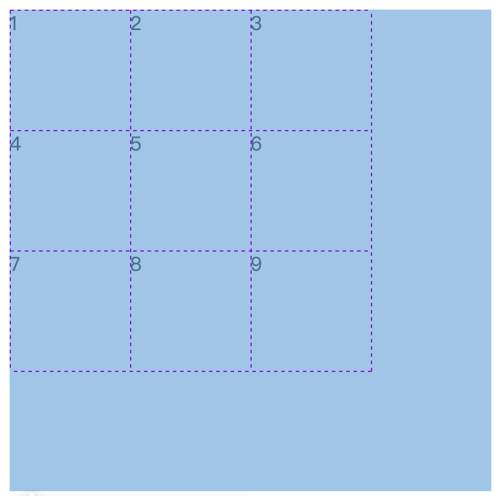
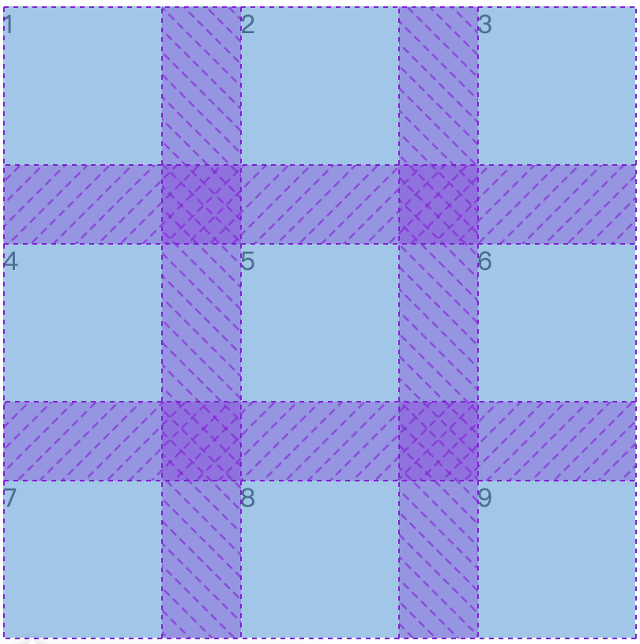

# 对齐

## 网格间距

### row/column-gap

在 Grid 中，**网格间距** 是指「**轨道**之间的空隙」， 包括：

- 行间距（row-gap）
- 列间距（column-gap）

```css
row-gap: 10px;
column-gap: 10px;
```

### gap

```css
gap:  [row-gap] [column-gap]
```

```css
.container {
  display: grid;
  grid-template-columns: repeat(3, 1fr);
  grid-template-rows: repeat(2, 100px);
  gap: 10px; /* 行列都10px */
}

```


:::tip gap的优势

使用`gap`可以告别`margin`的痛点：需要写复杂的选择器

:::

## 控制网格在容器中的对齐

这两个属性用于控制**整个网格容器**在可用空间内的对齐方式，当网格的**总大小小于容器时生效**。如果网格内容刚好占满或超过容器大小，`justify-content` 和`align-content`将不会有任何视觉效果。



### justify-content

`justify-content` 在 **Grid 布局**中负责控制 items在主轴（水平轴）上的对齐方式。

```css
justify-content:start | end | center | space-between | space-around | space-evenly
```


```css
.container {
  display: grid;
  grid-template-columns: repeat(3, 100px);
  grid-template-rows: 100px;
  justify-content: center;
  gap: 10px;
  border: 2px dashed #ccc;
  height: 200px;
}

```


### align-content

`align-content` 在 **Grid 布局**中负责控制 items在交叉轴上的对齐方式。

```css
align-content:start | end | center | space-between | space-around | space-evenly
```

```css
.container {
  display: grid;
  grid-template-columns: repeat(3, 100px);
  grid-template-rows: repeat(2, 100px);
  align-content: space-evenly;
  height: 400px;
  border: 2px dashed #ccc;
}

```



### gap与网格容器对齐

```css
      .container {
        display: grid;
        width: 400px;
        height: 400px;
        grid-template-columns: repeat(3, 100px);
        grid-template-rows: repeat(3, 100px);
        justify-content: space-between;
        align-content: space-between;
        gap: 10px;
      }
```

当 `justify-content` / `align-content` 参与计算时，会让浏览器优先使用可用空间来拉开轨道，这导致：

- **gap<分配的空间**：

  gap 固定为 10px，但你设置的 *space-between* 会把剩余空间扩大分配，使实际看到的“间距”包含了被拉大的空间，不再是 gap 定义的 10px。gap将不会有任何效果

- **gap>分配的空间**：

  gap设置的值如果大于分配的空间，将会把网格撑开，此时`justify-content` / `align-content`失效，因为网格的宽和高已经超过容器的大小

::: tip 总结

网格间隙=max(gap,分配的空间)

:::

## item内对齐

justify-items，align-itmes，justify-self，align-self的可用属性有：

```css
 stretch | start | center | end 
```

- 默认：stretch

### 容器统一控制

- justify-items：所有单元格内主轴对齐方式

- align-itmes：所有单元格内交叉轴对齐方式

### item独立控制

- justify-self：某个单元格内主轴对齐方式

- align-self：某个单元格内交叉轴对齐方式


