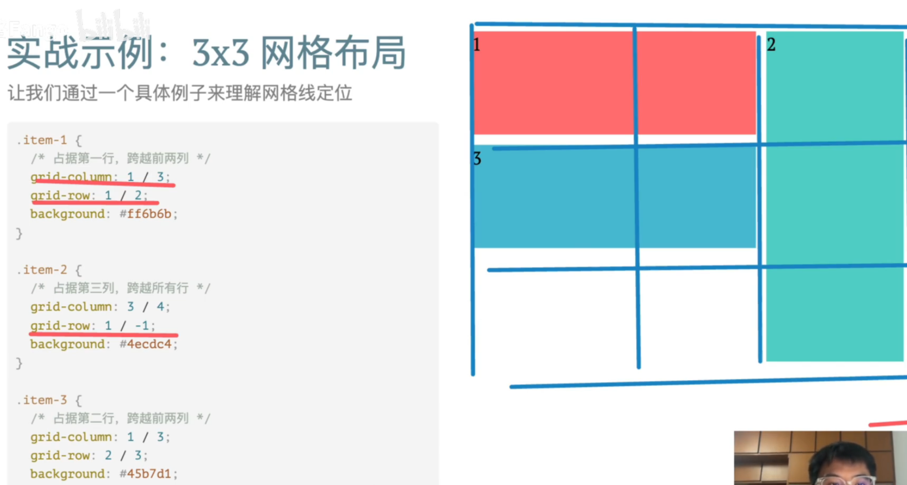

# 网格线定位

一个grid元素可以跨越多行或者多列，我们可以指定一个 **Grid 子元素的起止位置**。

## grid-column-start /end

```css
grid-column-start:1
grid-column-end:3
```

元素从第 **1 条纵向网格线**开始。

元素在第 **3 条纵向网格线**结束。

## grid-row-start /end

```css
grid-row-start:2
grid-row-end:4
```


元素从第 **2 条横向网格线**开始。

元素在第 **4 条横向网格线**结束。

## 简写

```css
grid-column: 1/3
grid-row:2/4
```


支持负数，-1表示最后一条网格线



## span

有时我们不关心网格元素的结束位置，只关心要跨越多少单元格，我们可以使用`span`。`span` 是 Grid 布局中用来 **表示跨多少行/列** 的关键字，用在 `grid-column`、`grid-row` 等属性里非常常用。

> **不再指定“结束的网格线编号”，而是指定“跨多少格”**。

- 使用 span（指定跨多少列）

  ```css
  grid-column: 1 / span 2;  /* 从第1条列线开始，跨2列 */
  ```

- 只写 span 会让 Grid 自动安排位置

  ```css
  grid-column: span 2; //我需要跨两列，你自动帮我找个合适的放置位置。
  ```

  

## 命名网格

