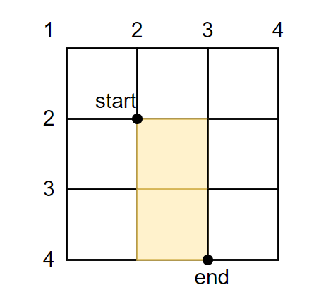

# 网格线定位

默认情况下，item会依次放入每一个单元格。

如果我们想自定义item在网格上的位置，我们可以使用网格线定位。



## grid-column-start /end

```css
grid-column-start:1
grid-column-end:3
```

元素从第 **1 条纵向网格线**开始。

元素在第 **3 条纵向网格线**结束。

## grid-row-start /end

```css
grid-row-start:2
grid-row-end:4
```


元素从第 **2 条横向网格线**开始。

元素在第 **4 条横向网格线**结束。

## grid-column /grid-row

`grid-column-start /end`可以简写成`grid-column`

`grid-row-start /end`可以简写成`grid-row`，

支持如下数值：

### number

number从1开始，表示第一条网格线

```css
grid-column: 1/3
grid-row:2/4
```

:::tip

- **支持负数，-1表示最后一条网格线**

- 实测`/`前后有无空格不影响

:::

### span

有时我们不关心网格元素的结束位置，只关心要跨越多少单元格，我们可以使用`span`。`span` 是 Grid 布局中用来 **表示跨多少行/列** 的关键字，用在 `grid-column`、`grid-row` 等属性里非常常用。

> **不再指定“结束的网格线编号”，而是指定“跨多少格”**。

- 使用 span（指定跨多少列）

  ```css
  grid-column: 1 / span 2;  /* 从第1条列线开始，跨2列 */
  ```

- 只写 span 会让 Grid 自动安排位置

  ```css
  grid-column: span 2; //我需要跨两列，你自动帮我找个合适的放置位置。
  ```


```html
<!DOCTYPE html>
<html lang="en">
  <head>
    <meta charset="UTF-8" />
    <meta name="viewport" content="width=device-width, initial-scale=1.0" />
    <title>Document</title>
    <style>
      .container {
        display: grid;
        grid-template-columns: repeat(3, 100px);
        grid-template-rows: repeat(3, 100px);
      }
      .item1 {
        background-color: yellow;
        grid-column: 1 / span 2;
        grid-row: 1 / 2;
      }
      .item2 {
        background-color: red;
        grid-column: 3 / 4;
        grid-row: 1 / span 3;
      }
      .item3 {
        background-color: blue;
        grid-column: 1 / span 2;
        grid-row: 2 / 3;
      }
    </style>
  </head>
  <body>
    <div class="container">
      <div class="item1">1</div>
      <div class="item2">2</div>
      <div class="item3">3</div>
    </div>
  </body>
</html>
```


