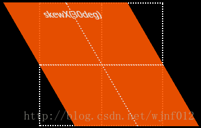
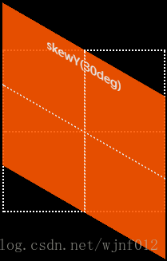

# transform

`transform` 是 CSS 中用于**对元素进行几何变换**的核心属性，不会影响文档流

```css
transform: transform-function1 transform-function2 ...;
```

默认值：

```css
transform: none;
```


## 2D transform 函数

https://css-transform.moro.es/

### 平移（translate）

不影响文档流，原来的位置仍然保留

x轴，y轴，z轴

```css
translate(x, y)
translateX(x)
translateY(y)
translateZ(z)
```

- px

```css
transform: translate(50px, 20px);
```

- 百分比

如果单位是百分比，则相对于元素自身尺寸，而非父容器

```css
transform: translate(50%, 50%);
```

### 缩放（scale）

```css
scale(num)//x,y都是num
scale(x, y)
scaleX(x)
scaleY(y)
scaleZ(z)
```

```css
transform: scale(1.2);
```

配合`overflow:hidden`可以确保扩大后不会超出父容器

### 旋转（rotate）

```css
rotate(45deg)
```

**1 deg = 1°**，一整圈是 **360 deg**，正值表示顺时针，负值表示逆时针。

```css
transform: rotate(90deg);
```

一圈也可以使用`1turn` 表示，注意1和turn之间没有空格

```css
transform: rotate(1turn);
```


::: warning

由于行内元素的布局特性，行内元素无法旋转，我们需要将其转换为行内块或块级元素

:::

:::tip

该属性受`transform-origin`影响

:::

### 倾斜（skew）

用于对元素进行二维倾斜变换，通过沿X轴或Y轴扭曲元素的几何形状，skew变换的单位是角度




- `skewX(30deg)`是在水平方向扭曲变形，但是在上图中我们可以看到实际是沿Y轴逆时针旋转30度



- `skewY(30deg)`是在水平方向扭曲变形，但是在上图中我们可以看到实际是沿X轴顺时针旋转30度

```css
skew(x-angle, y-angle)
skewX(angle)
skewY(angle)
```

```css
transform: skewX(20deg);
```

:::tip

该属性受`transform-origin`影响

:::

##  transform的复合写法

```css
transform: funcA funcB funcC
```

函数执行顺序**从右向左**：funcC ->funcB->funcA

:::warning  `transform` 不能拆开写，**会整体覆盖**。

```css
//让一个定位居中的元素右移动
.box {
  position: absolute;
  top: 50%;
  transform: translateY(-50%);
  transition: transform 0.3s ease;
}

.box:hover {
  transform: translate(500px, -50%);
}

```


:::


## transform-origin

**`transform-origin`** CSS 属性让你更改一个元素变形的原点。默认的转换原点是 `center`。

```css
transform-origin: center;
transform-origin: top left;
transform-origin: 50px 50px;
```

`transform-origin`参考的是 **元素自身的内容盒（border-box）**

```css
(0,0) ───────────────► x
  │
  │   ● (50,50)  ← transform-origin
  │
  ▼
  y

```


## Skills

### 定位元素的居中

- 水平居中

```css
.box {
  position: absolute;
  left: 50%;
  transform: translateX(-50%);
}

```


- 垂直居中

```css
.box {
  position: absolute;
  top: 50%;
  transform: translateY(-50%);
}

```


- 居中

依靠translate(-50%, -50%)是相对于自身的特性，可以实现定位元素的居中效果

```css
        .box {
            width: 100px;
            height: 100px;
            background-color: red;
            position: absolute;
        }

        .item {
            height: 20px;
            width: 20px;
            position: relative;
            top: 50%;
            left: 50%;
            transform: translate(-50%, -50%);
            background-color: blue;
        }
```

### 平行四边形

```css
skewX(-16deg)
```

## Examples

https://aito.auto/model/m8/

https://world.qq.com/
