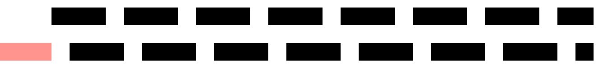

# SVG属性

## 根元素属性

| 属性                  | 说明                                   |
| --------------------- | -------------------------------------- |
| `width`               | 显示宽度                               |
| `height`              | 显示高度                               |
| `viewBox`             | 内部坐标系（`minX minY width height`） |
| `preserveAspectRatio` | 缩放对齐规则                           |

```css
<svg width="100" height="100" viewBox="0 0 100 100">
```

## 通用样式属性

所有图形几乎都能用。SVG的样式属性类似于行内样式，我们也可以给SVG设置内联样式

### fill

图形的填充颜色

```css
svg {
    fill: none;
}
```

:::tip

`fill`类似于`color`属性，我们对根元素使用时，如果子元素存在`fill`内联属性，则无效。我们可以有如下方式解决：

- 删除子元素的`fill`属性，根据继承的特性，子元素可以继承SVG的颜色

- 使用CSS选择器替换表现型属性，直接更改样式

  ```css
  svg path{
    fill:none;
  }
  ```

  

:::

### stroke

图形的描边颜色

### stroke-width

描边宽度

### stroke-dasharray

```css
stroke-dasharray: 5px;
stroke-dasharray: 5px 10px;
```

第一个数是实线长度，第二个数是间隔长度

```html
[ 实线长度 ][ 间隔长度 ][ 实线长度 ][ 间隔长度 ] ...
```

::: tip 虚线是如何绘制出来的？

虚线将从起始点开始，根据`stroke-dasharray`设置的实线和间隙的长度开始绘制。

:::

### stroke-dashoffset

`stroke-dashoffset` 用来**平移整个虚线模式（相当于更改了虚线绘制的起点）**，单位是 **SVG 用户坐标单位**（通常等同于 px）。必须配合 `stroke-dasharray` 才有意义。

负值 = 往前走，正值 = 往后退

```html
  <!-- 没有设置偏移量 -->
  <line x1="0" y1="3" x2="30" y2="3" stroke="black" stroke-dasharray="3 1" />

  <!-- 虚线正向偏移了 3 个单位 -->
  <line
    x1="0"
    y1="5"
    x2="30"
    y2="5"
    stroke="black"
    stroke-dasharray="3 1"
    stroke-dashoffset="3" />
```



## 几何属性

不同元素拥有的几何属性也不同

```html
<rect x="10" y="10" width="80" height="40" rx="8" />
```

```html
<polygon points="10,10 90,10 50,90" />
```


