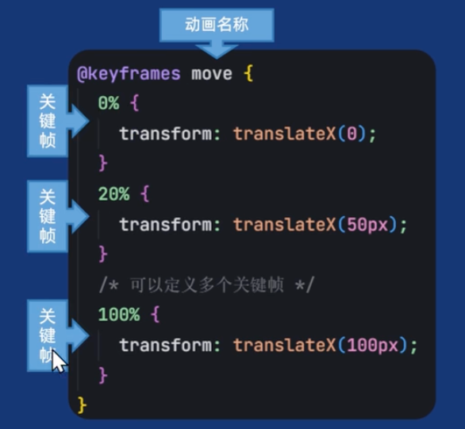

# animation

传统的CSS的transition只能定义两帧的局限性。animation可以定义多帧动画。

浏览器原生支持，性能优秀。


## 定义动画关键帧（@keyframes）

`@keyframes` +动画名称定义一个动画

如果动画只存在两个状态，可以使用`from`和`to`定义关键帧。from相当于`0%`，to相当于`100%`

```css
@keyframes moveRight {
  from {
    transform: translateX(0);
  }
  to {
    transform: translateX(500px);
  }
}

```

也可以用百分比：

```css
@keyframes moveRight {
  0% {
    transform: translateX(0);
  }
  50% {
    transform: translateX(200px);
  }
  100% {
    transform: translateX(500px);
  }
}

```



::: warning

- `@keyframes` 只能写在最外层，不能嵌套在选择器里
- `@keyframes` 不要求一定写在使用之前。类似`var`
- 如果某一个关键帧出现了重复的定义，且重复的关键帧中的 CSS 属性值不同，则以最后一次定义的属性为准【CSS属性的层叠性】

:::

## 使用动画

### animation

animation是多个属性的简写

```css
animation: name duration timing-function delay iteration-count direction fill-mode play-state;
```

| 属性名                      | 是否必填 | 作用                              | 常见取值 / 示例                             |
| --------------------------- | -------- | --------------------------------- | ------------------------------------------- |
| `animation-name`            | 否       | 指定动画名称（对应 `@keyframes`） | `move`                                      |
| `animation-duration`        | **是**   | 动画持续时间                      | `1s`、`500ms`                               |
| `animation-timing-function` | 否       | 速度曲线                          | `linear`、`ease`、`ease-in-out`、`steps(5)` |
| `animation-delay`           | 否       | 动画延迟时间                      | `0s`、`1s`                                  |
| `animation-iteration-count` | 否       | 执行次数                          | `1`、`3`、`infinite`                        |
| `animation-direction`       | 否       | 执行方向                          | `normal`、`reverse`、`alternate`            |
| `animation-fill-mode`       | 否       | 动画结束后的状态                  | `none`、`forwards`、`backwards`、`both`     |


### animation-name

指定动画名称（对应 `@keyframes`）


### animation-iteration-count

设置动画在停止前应播放的次数

```css
/* 无限循环 */
animation-iteration-count: infinite;

/* 重复3次 */
animation-iteration-count: 3;
```


### animation-direction

动画播放的方向

```css
normal             正向（默认）【0%->100%】
reverse            反向【100%->0%】
alternate          正向 → 反向【0%->100%->0%】
alternate-reverse  反向 → 正向【100%->0%->100%】
```


###  animation-fill-mode

animation-fill-mode 决定：动画“开始前”和“结束后”，元素长什么样

```css
none        默认，回到初始状态
forwards    停留在最后一帧
backwards   延迟期间显示第一帧
both        forwards + backwards
```

```css
@keyframes move {
  from { transform: translateX(0); }
  to   { transform: translateX(300px); }
}

.box {
  animation: move 2s 1s; /* 2秒动画，延迟1秒 */
}

```

| fill-mode      | 动画开始前（delay期间） | 动画结束后       |
| -------------- | ----------------------- | ---------------- |
| `none`（默认） | 初始样式                | 回到初始样式     |
| `forwards`     | 初始样式                | **停在最后一帧** |
| `backwards`    | **第一帧样式**          | 回到初始样式     |
| `both`         | **第一帧样式**          | **停在最后一帧** |

```css
0s        1s            3s
|---delay---|---动画执行---|
```


### animation-play-state

播放状态，用于控制暂停或继续动画。`animation-play-state`无法写在`animation`复合写法中，需要单独声明

```css
running   播放（默认）
paused    暂停
```


```css
.box:hover {
  animation-play-state: paused;
}

```

## Example

https://browser.360.cn/ee/mac/index.html

## steps

逐帧动画
