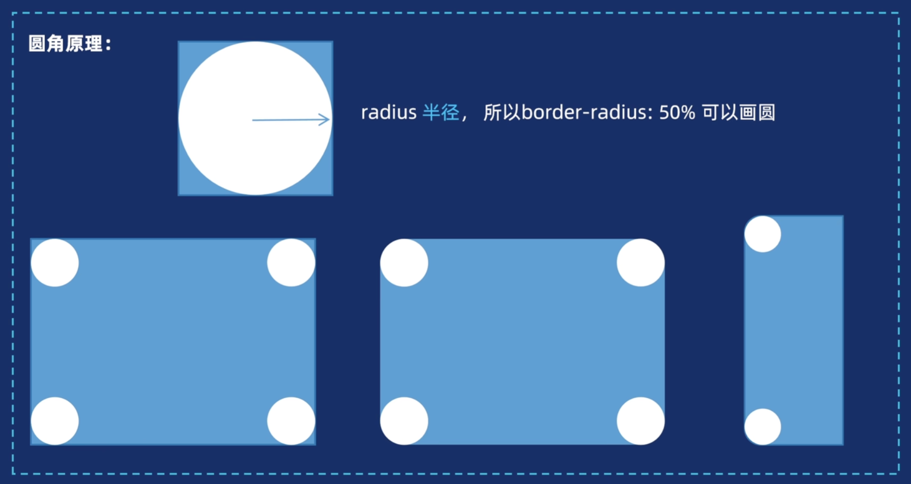

# 圆角

# 圆角


## border-radius

常用属性值：

- 数字

```css
border-radius: 10px;

```

- **百分比**

```
border-radius: 50%;

```

- 支持多个值，控制四个圆角

```css
/*对角线：↖↘10px ，↗↙ 20px*/
border-radius: 10px 20px;

/*↖ 10px ↗↙ 20px ↘ 30px*/
border-radius: 10px 20px 30px;

/* 4个值（↖开始，顺时针） */
border-radius: 10px 20px 30px 40px;

```


常见场景：

- 圆形：正方形+圆角是边的一半

```css
width:100px;
height:100px;
border-radius: 50%;/*或者50px*/
```


- 胶囊按钮：矩形+圆角是短边的一半

```css
width:100px;
height:20px;
border-radius: 50%;/*或者10px*/
```


:::tip

img标签也可以设置`border-radius`，效果与box model相同

:::


## 原理

border-radius本质上就是根据指定值为半径画圆，然后裁去多余的部分


