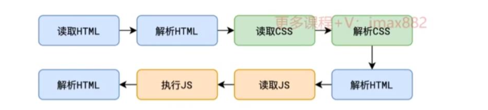

# 浏览器渲染流程

## 解析HTML（构建DOM）

浏览器自上而下解析 HTML，遇到标签就创建对应的 **DOM 节点**，生成 **DOM Tree**。

图片、视频、音频不会阻塞解析

::: warning **遇到同步 `<script>` 会阻塞 HTML 解析**

`defer`：HTML 解析完成后执行

`async`：下载完成立即执行（可能打断解析）

:::


```html
<!DOCTYPE html>
<html lang="zh-CN">

<head>
  <meta charset="UTF-8" />
  <link rel="icon" href="/favicon.ico" />
  <link rel="stylesheet" href="/css/loading.css" type="text/css" />
  <meta name="viewport" content="width=device-width, initial-scale=1.0" />
  <title>管理系统</title>
</head>

<body>
  <div id="app">
    <div class="init-page">
      <div class="snow-loader"></div>
    </div>
  </div>
  <script type="module" src="/src/main.ts"></script>
</body>

<script>
  window.global = window;
</script>

</html>

```





## 解析 CSS（构建 CSSOM）

[**CSS 对象模型（CSSOM）**](https://developer.mozilla.org/zh-CN/docs/Web/API/CSS_Object_Model)是一系列用于读取和修改文档样式相关的（CSS）信息的 API。换句话说，[DOM](https://developer.mozilla.org/zh-CN/docs/Web/API/Document_Object_Model) 使得 JavaScript 可以读取和修改文档的结构和内容，CSSOM 则使得 JavaScript 可以读取和修改文档样式。

- 解析所有 CSS（包括 `<style>`、外链 CSS）
- 生成 **CSSOM Tree**
- CSS 是 **阻塞渲染的资源**

> 在 CSSOM 未完成前，浏览器不会构建 Render Tree
>  （避免出现“无样式 → 有样式”的闪烁）

::: tip 为什么要将CSS写到页面的开头，而JS写到页面的最后

将CSS写到页面开头，是为了让浏览器尽快读取并解析CSSOM，避免给用户看到丑陋的页面，也是避免页面闪烁

将JS代码写到最后，是为了让浏览器尽快呈现给用户，然后再执行JS完成**交互功能**

:::

## 构建 Render Tree

CSS属性的计算过程

DOM Tree + CSSOM Tree


## Layout/Reflow（布局 / 回流）

布局/回流的耗时较大

- 计算每个元素的尺寸和位置

以下JS操作会触发回流：

- 获取元素的尺寸和位置（需要获取元素的尺寸和位置，自然就需要强制执行layout计算）
- 直接或间接改变元素的尺寸和位置

## Paint/Repaint绘制

将 Render Tree绘制

绘制的过程是靠GPU完成的
