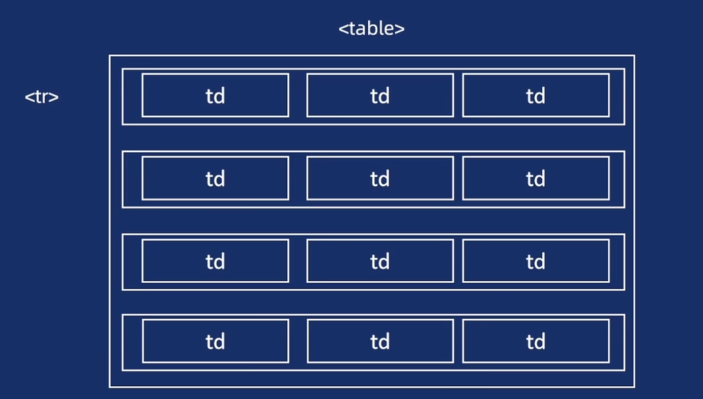

# 表格



## 标签

表格默认不存在边框

| 标签      | 说明                                                     | 使用频率       |
| --------- | -------------------------------------------------------- | -------------- |
| `<table>` | 整个表格的容器。                                         | 必须           |
| `<tr>`    | 表格行（table row）。                                    | 必须           |
| `<th>`    | 表头单元格（table header cell，一般在 `<thead>` 中）。   | 必须           |
| `<td>`    | 表格数据单元格（table data cell，一般在 `<tbody>` 中）。 | 必须           |
| `<thead>` | 表头部分（可选，用于定义表格列标题）。                   | 常用，可选     |
| `<tbody>` | 表格主体（主要数据部分）。                               | 常用，可选     |
| `<tfoot>` | 表格底部（汇总信息、总计等）。                           | 极少使用，可选 |

```html
<!-- 需要显示边框，可以添加border="1" -->
<table>
  <thead>
    <tr>
      <th>姓名</th>
      <th>语文</th>
      <th>数学</th>
    </tr>
  </thead>

  <tbody>
    <tr>
      <td>张三</td>
      <td>90</td>
      <td>88</td>
    </tr>
    <tr>
      <td>李四</td>
      <td>95</td>
      <td>93</td>
    </tr>
  </tbody>

  <tfoot>
    <tr>
      <td>平均分</td>
      <td>92.5</td>
      <td>90.5</td>
    </tr>
  </tfoot>
</table>
```

<table>
  <thead>
    <tr>
      <th>姓名</th>
      <th>语文</th>
      <th>数学</th>
    </tr>
  </thead>

  <tbody>
    <tr>
      <td>张三</td>
      <td>90</td>
      <td>88</td>
    </tr>
    <tr>
      <td>李四</td>
      <td>95</td>
      <td>93</td>
    </tr>
  </tbody>

  <tfoot>
    <tr>
      <td>平均分</td>
      <td>92.5</td>
      <td>90.5</td>
    </tr>
  </tfoot>
</table>

::: warning
表格的样式控制请用 CSS
:::

## 单元格合并 <Badge text="AI" />
