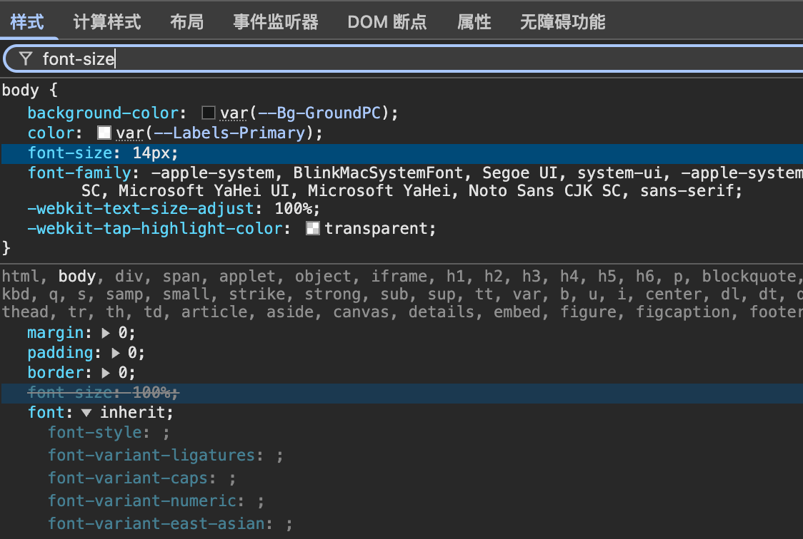

# 调试工具

## 样式面板

- 显示所有作用于该元素的 CSS 规则
- 选择器按优先级从高到低排列
- 被覆盖的样式会有删除线



- **点击属性名前的复选框**：临时禁用/启用某个属性

- 在样式面板顶部有搜索框，可以快速查找特定**CSS属性**

### 内联样式

`element.style` 就是**内联样式**——直接写在标签里的 `style=""` 那一块。在 DevTools 里它永远出现在 **Styles 面板最顶部**，即优先级最高

```css
element.style{
  
}
```

### 用户代理样式表

**“用户代理样式表”**（`user agent stylesheet`）说明这条规则是**浏览器自带的默认样式**，而不是你的 CSS 写的。


## 计算样式面板

“计算样式” （英文版叫 **Computed**）是 DevTools 里专门用来看“**最终到底长什么样**”的面板。

### 斜体

**斜体 = 这条属性是“计算后得出”的，而不是从某条 CSS 规则里“直接声明”的。**
换句话说，**你的样式表里没有写 `width`，浏览器是根据其他规则（内容、flex、grid、表格算法等）“算”出来的最终值。**

### 跳转

点击某个属性右侧的箭头，可跳转到对应规则来源。
