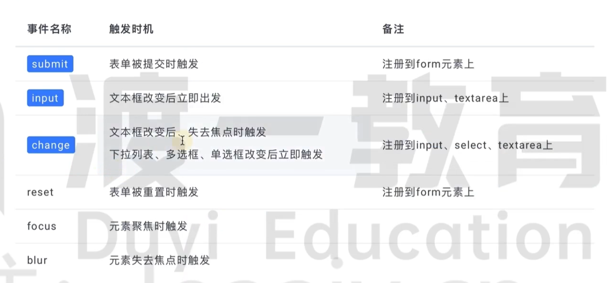
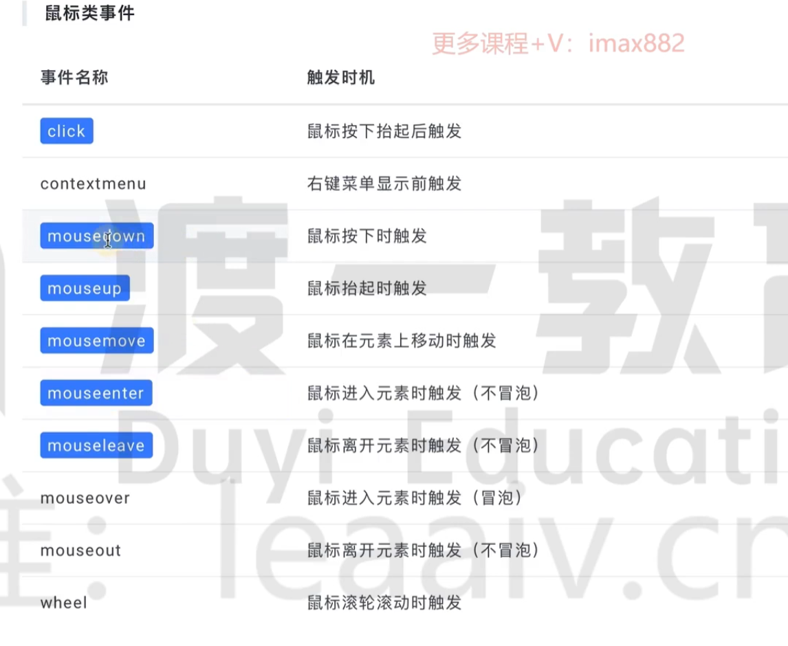
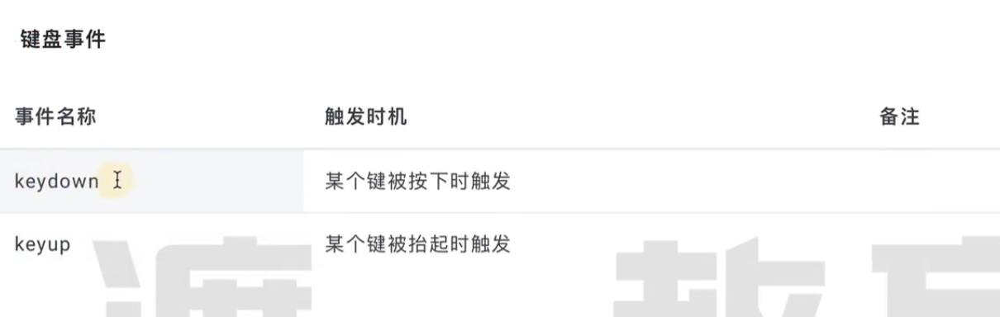
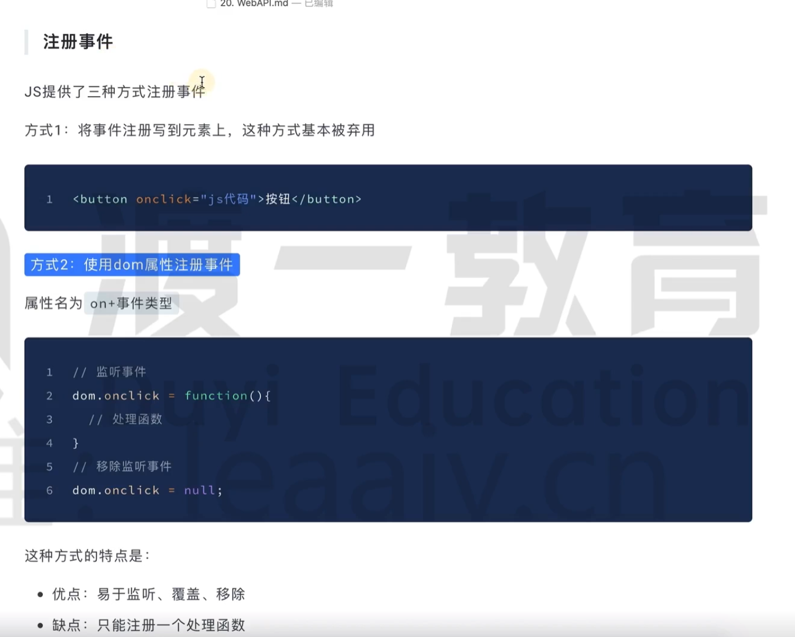
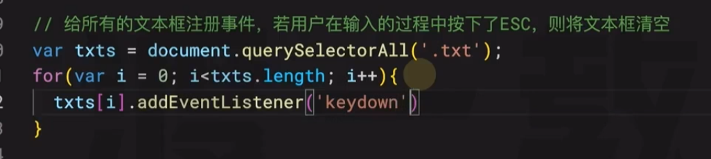
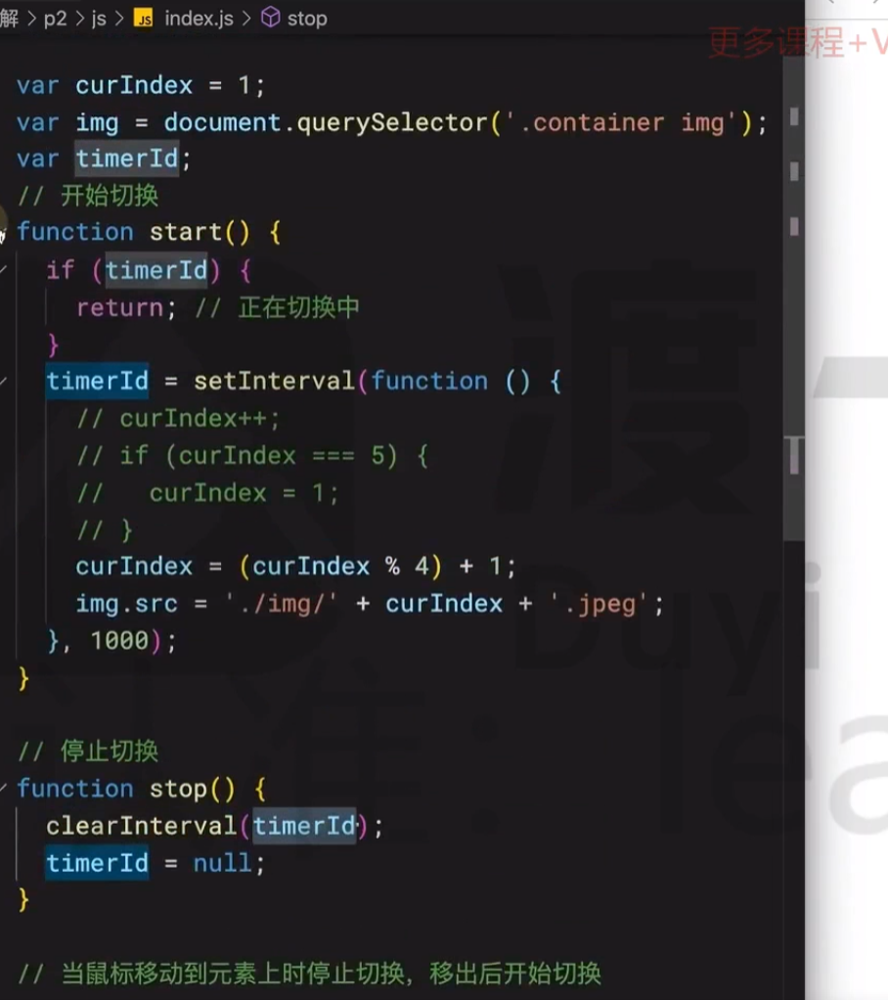
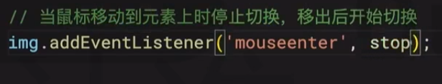

# 监听DOM事件

 **DOM 元素的事件处理属性（Event Handler Property）**

- `onclick` 是一个 **可读写属性**，在任何时刻都可以读写

- 值必须是 **函数 或 null**

- 浏览器在事件触发时，会自动调用这个函数

## 注册事件

这种方式存在被覆盖的可能。

## 移除监听

## 事件处理函数

### event

### this

this始终指向当前的DOM对象，this的优势：获取得到的DOM变量，后续可能会变null，但是这不会影响this的指向

