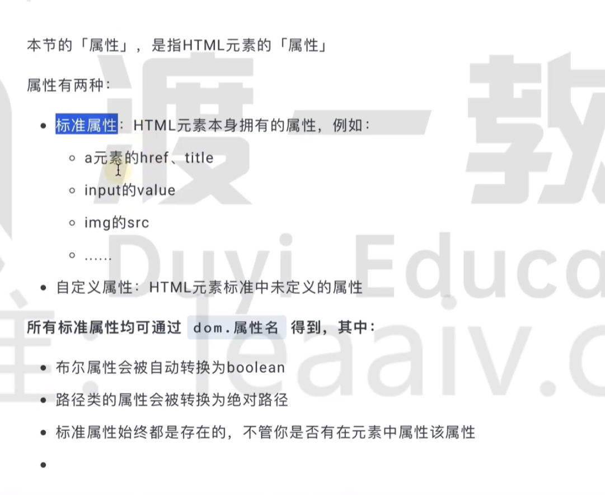

# DOM操作

 **Document Object Model**

DOM相关的操作都在`window.document`上

## DOM树

```html
    <div class="box">
      what is <strong>dom</strong>?
    </div>
```

TextNode文本节点`what is`、`?`

ElementNode元素节点：`<strong>dom</strong>`


## 获取DOM

| 方法                   | 含义               | 返回值         |
| ---------------------- | ------------------ | -------------- |
| getElementById         | 根据id获取DOM      | Element        |
| getElementsByClassName |                    | HTMLCollection |
| getElementsByTagName   | 根据标签名获取DOMs | HTMLCollection |
| querySelector          |                    | Element        |
| querySelectorAll       |                    | NodeList       |

## documentElement

获取文档的根元素

```ts
console.log(document.documentElement) // <html>...</html>
```


## querySelector()

```ts
const el = document.querySelector('.box')
```

- 支持 **任意 CSS 选择器**
- 返回 **第一个匹配元素或 `null`**
- 实际项目最常用


## querySeletctorAll()

```ts
const els = document.querySelectorAll('.item')
```

- 支持 **任意 CSS 选择器**
- 返回 **NodeList（静态）**,表示所有满足的元素

- 可直接使用 `forEach`


## 从已有元素向下查找

```ts
const container = document.querySelector('.container')
const item = container.querySelector('.item')
```

- **不会从 document 全局查**
- 性能更好
- 作用域更安全

## DOM 关系获取（兄弟 / 父子）

- 父节点

`parentNode` 总是返回一个 Node：

- 可能是 `Element`、`Document`、`DocumentFragment`

`parentElement` 总是返回一个 Element：

- 如果父节点不是元素 → 返回 `null`

```ts
el.parentNode
el.parentElement
```


- 子节点

元素节点

```ts
el.children
//<strong>dom</strong>
```

所有节点（包含文本）：

```ts
el.childNodes     
// [text,strong,text]
```

- 兄弟节点

```ts
el.previousElementSibling
el.nextElementSibling
```


## 创建DOM

```ts
const div = document.createElement('div')
div.className = 'box'
div.textContent = 'hello'
```


## 更改DOM

### remove

`remove` 指的是将自己(当前节点) **从文档树中移除**。

```ts
const el = document.querySelector('.box')
el.remove()
```


### removeChild

`removeChild` 是 **由父节点调用，用来移除指定子节点的方法**，

```ts
parent.removeChild(child)
```

```ts
const parent = document.getElementById('list')
const li = document.getElementById('item')

parent.removeChild(li)

```


### insertBefore

```ts
parent.insertBefore(newNode, referenceNode)
```

- `newNode`：要插入的节点
- `referenceNode`：参考节点（插在它**前面**）
- 返回值：`newNode`

```ts
const ref = document.querySelector('.item')
parent.insertBefore(newEl, ref)
```


### appendChild

`appendChild` 是 **把一个节点追加为父节点的“最后一个子节点”** 的 DOM 方法

```ts
parent.appendChild(child)
```

作用：

- 把 `child` 放到 `parent` 的 **子节点末尾**
- 返回被追加的那个 `child`


## DOM属性



- 属性可以重新赋值
- 
