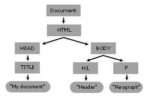

# DOM树

## DOM

 **Document Object Model**，DOM相关的操作都在`window.document`上，因为Document是文档的入口，也是根节点

## DOM树

**DOM 树完全由 Node 对象组成**，每一个节点都是 `Node` 的实例或继承自 `Node` 的对象。可以是Document、Element、Text、Comment。

```html
<html lang="en">
  <head>
    <title>My Document</title>
  </head>
  <body>
    <h1>Header</h1>
    <p>Paragraph</p>
  </body>
</html>
```


