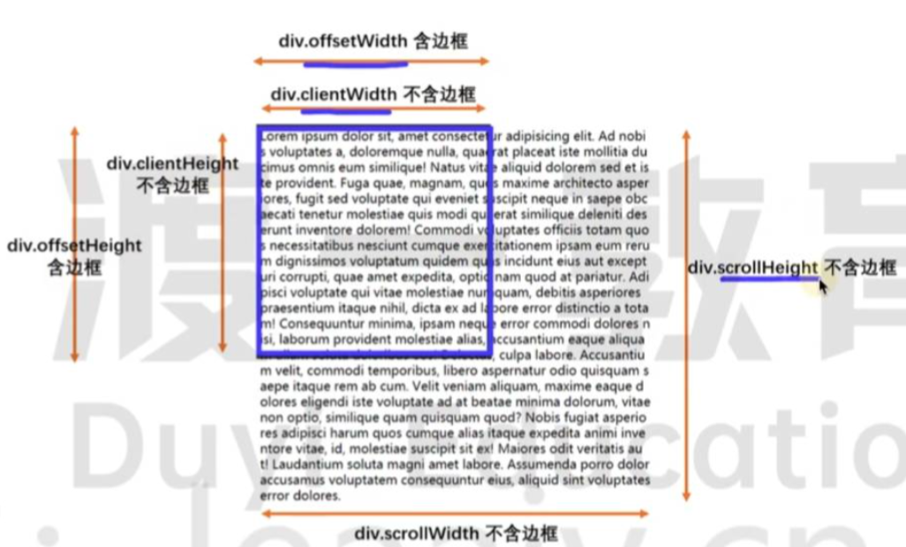
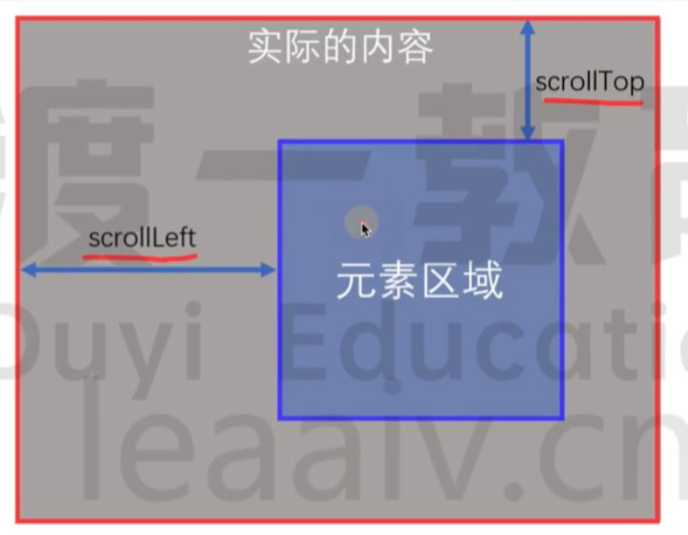

# Element


## Class

```ts
EventTarget
    └── Node
        └── Element
```


## Properties

###  innerHTML

- 类型：string
- 定义：渲染前的HTML 内容

```html
    <div id="box">
      Hello
      <span style="color: red">World</span>
    </div>
```

```ts
box.innerHTML

/*
      Hello
      <span style="color: red">World</span>
*/
```


### outerHTML

- 定义：渲染前，包含自身的 HTML

```ts
box.outerHTML
/*
<div id="box">
      Hello
      <span style="color: red">World</span>
    </div>
    */
```

### children

- 类型：HTMLCollection

该元素的所有“元素子节点”。**只包含元素节点（Element）**，不包含：**文本节点**、**注释节点**。

:::code-group

```html
<div id="box">
  文本
  <span></span>
  <!-- 注释 -->
  <p></p>
</div>

```

```ts
const box = document.getElementById('box')!
box.children.length // 2
box.children[0].tagName // 'SPAN'
box.children[1].tagName // 'P'
```


:::

### previousElementSibling

- 类型：Element

**`previousElementSibling`** 返回当前元素在其父元素的子元素节点中的前一个Element【同级前】，如果该元素已经是第一个元素节点，则返回 `null`, 该属性是只读的。

```html
<ul>
  <li>苹果</li>
  <li id="target">香蕉</li>
  <li>橘子</li>
</ul>

```

```ts
const target = document.getElementById('target')!
const prev = target.previousElementSibling

console.log(prev?.textContent) // 苹果
```


### nextElementSibling

- 类型：Element

**`nextElementSibling`** 返回当前元素在其父元素的子元素节点中的后一个Element【同级后】，如果该元素已经是最后一个元素节点，则返回 `null`, 该属性是只读的。

```ts
const target = document.getElementById('target')!
const next = target.nextElementSibling

console.log(next?.textContent) // 橘子
console.log(target.previousElementSibling.innerText);//橘子，本质上还是HTMLElement，可以使用innerText。

```

### client*

元素可视区域尺寸。

该属性包括内边距（padding），但不包括边框（border）、外边距（margin）和滚动条


```ts
element.clientWidth
element.clientHeight
element.clientLeft  
element.clientTop    
```

| 属性    | 是否包含 |
| ------- | -------- |
| padding | √        |
| border  | ×        |
| margin  | ×        |
| scroll  | ×        |

::: warning clientHeight的特例

- 如果该元素是`html`元素且该元素的[节点文档](https://dom.spec.whatwg.org/#concept-node-document)不在[怪异模式](https://dom.spec.whatwg.org/#concept-document-quirks)中

- 或者如果该元素是`body`元素且该元素的[节点文档](https://dom.spec.whatwg.org/#concept-node-document)*在*[怪异模式](https://dom.spec.whatwg.org/#concept-document-quirks)中

以上两种情况下将返回[视口](https://www.w3.org/TR/2016/WD-cssom-view-1-20160317/#viewport)高度，不包括渲染的滚动条的大小

:::

### offset*

元素布局占用尺寸

| 属性    | 是否包含 |
| ------- | -------- |
| padding | √        |
| border  | √        |
| margin  | ×        |
| scroll  | √        |


```ts
element.offsetWidth
element.offsetHeight
element.offsetLeft   
element.offsetTop
```


### scroll*

包括由于溢出而在屏幕上不可见的内容
```ts
element.scrollWidth
element.scrollHeight
element.scrollTop
element.scrollLeft
```

| 属性    | 是否包含 |
| ------- | -------- |
| padding | √        |
| border  | ×        |
| margin  | ×        |
| scroll  | ×        |






## Methods

### remove

`remove` 指的是将自己(当前节点) **从文档树中移除**。

```ts
const el = document.querySelector('.box')
el.remove()
```


### scroll

用于在给定的元素中滚动到某个特定坐标

```ts
scroll(scrollLeft, scrollRight)
scroll(options)
```

- [`scrollLeft`](https://developer.mozilla.org/zh-CN/docs/Web/API/Element/scroll#x-coord)

  你想要显示在左上角的元素沿水平轴的像素。

- [`scrollRight`](https://developer.mozilla.org/zh-CN/docs/Web/API/Element/scroll#y-coord)

  你想要显示在左上角的元素沿垂直轴的像素。

- [`options`](https://developer.mozilla.org/zh-CN/docs/Web/API/Element/scroll#options)

  包含以下参数的对象：[`top`](https://developer.mozilla.org/zh-CN/docs/Web/API/Element/scroll#top)指定沿 Y 轴滚动窗口或元素的像素数。[`left`](https://developer.mozilla.org/zh-CN/docs/Web/API/Element/scroll#left)指定沿 X 轴滚动窗口或元素的像素数。[`behavior`](https://developer.mozilla.org/zh-CN/docs/Web/API/Element/scroll#behavior)`smooth` 表示平滑滚动并产生过渡效果，`auto` 或缺省值会直接跳转到目标位置，没有过渡效果。

### getBoundingClientRect

- bounding：边界

- client：可视/客户端区域

- rect：矩形

- Return：DOMRect，其提供了元素的大小及其相对于[视口](https://developer.mozilla.org/zh-CN/docs/Glossary/Viewport)的位置。

DOMRect包含整个元素的最小矩形（包括 `padding` 和 `border-width`）。

```ts
interface DOMRect {
  readonly top: number
  readonly right: number
  readonly bottom: number
  readonly left: number

  readonly width: number//盒模型宽，和 box-sizing: border-box时的width相同
  readonly height: number//盒模型高，和 box-sizing: border-box时的height相同

  readonly x: number
  readonly y: number
}


```


