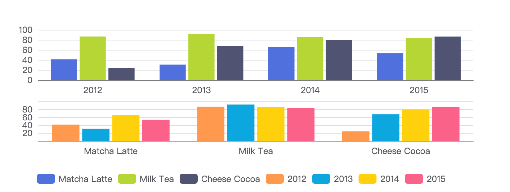

# dataset

`数据集`（`dataset`）组件用于单独的数据集声明，从而数据可以单独管理，被多个组件复用，并且可以自由指定数据到视觉的映射。这在不少场景下能带来使用上的方便。

> `数据集（dataset）`是专门用来管理数据的组件。虽然每个系列都可以在 `series.data` 中设置数据，但是从 ECharts4 支持数据集开始，更推荐使用数据集来管理数据。因为这样，数据可以被多个组件复用，也方便进行 “数据和其他配置” 分离的配置风格。毕竟，在运行时，数据是最常改变的，而其他配置大多并不会改变。

## 系列数据

```ts
option = {
  xAxis: {
    type: 'category',
    data: ['Matcha Latte', 'Milk Tea', 'Cheese Cocoa', 'Walnut Brownie']
  },
  yAxis: {},
  series: [
    {
      type: 'bar',
      name: '2015',
      data: [89.3, 92.1, 94.4, 85.4]
    },
    {
      type: 'bar',
      name: '2016',
      data: [95.8, 89.4, 91.2, 76.9]
    },
    {
      type: 'bar',
      name: '2017',
      data: [97.7, 83.1, 92.5, 78.1]
    }
  ]
};
```


## source

dataset 本质就是一张 **二维表**（行 + 列），类似 Excel

### 数组格式

数组格式，第一行是`dimensions`，第一列是series的名字

ECharts可以自动识别`dataset`的列名，第一列的列名是`'product'`，第二列的列名是`'2015'`

```ts
option = {
  legend: {},
  tooltip: {},
  dataset: {
    // 提供一份数据。
    source: [
      ['product', '2015', '2016', '2017'],
      ['Matcha Latte', 43.3, 85.8, 93.7],
      ['Milk Tea', 83.1, 73.4, 55.1],
      ['Cheese Cocoa', 86.4, 65.2, 82.5],
      ['Walnut Brownie', 72.4, 53.9, 39.1]
    ]
  },
  // 声明一个 X 轴，类目轴（category）。默认情况下，类目轴对应到 dataset 第一列。
  xAxis: { type: 'category' },
  // 声明一个 Y 轴，数值轴。
  yAxis: {},
  // 声明多个 bar 系列，默认情况下，每个系列会自动对应到 dataset 的每一列。
  series: [{ type: 'bar' }, { type: 'bar' }, { type: 'bar' }]
};
```


### 对象数组格式

```ts
option = {
  legend: {},
  tooltip: {},
  dataset: {
    dimensions: ['product', '2015', '2016', '2017'],
    source: [
      { product: 'Matcha Latte', '2015': 43.3, '2016': 85.8, '2017': 93.7 },
      { product: 'Milk Tea', '2015': 83.1, '2016': 73.4, '2017': 55.1 },
      { product: 'Cheese Cocoa', '2015': 86.4, '2016': 65.2, '2017': 82.5 },
      { product: 'Walnut Brownie', '2015': 72.4, '2016': 53.9, '2017': 39.1 }
    ]
  },
  xAxis: { type: 'category' },
  yAxis: {},
  series: [{ type: 'bar' }, { type: 'bar' }, { type: 'bar' }]
};
```

## dimensions

可以使用 `dimensions` 指定维度的顺序。

- 直角坐标系中，如果 X 轴 type 为 category，默认把第一个维度映射到 X 轴上，后面维度映射到 Y 轴上。

- 如果不指定 `dimensions`，也可以通过指定 `series.encode`

常用图表所描述的数据大部分是“二维表”结构，上述的例子中，我们都使用二维数组来容纳二维表。现在，当我们把系列（series）对应到“列”的时候，那么每一列就称为一个“维度（dimension）”，而每一行称为数据项（item）。反之，如果我们把系列（series）对应到表行，那么每一行就是“维度（dimension）”，每一列就是数据项（item）。


## 数据到图形的映射

### seriesLayoutBy

用户可以使用 `seriesLayoutBy` 配置项，改变图表对于行列的理解。`seriesLayoutBy` 可取值：

- `'column'`: 默认值。系列被安放到 `dataset` 的列上面。
- `'row'`: 系列被安放到 `dataset` 的行上面。

```ts
option = {
  legend: {},
  tooltip: {},
  dataset: {
    source: [
      ['product', '2012', '2013', '2014', '2015'],
      ['Matcha Latte', 41.1, 30.4, 65.1, 53.3],
      ['Milk Tea', 86.5, 92.1, 85.7, 83.1],
      ['Cheese Cocoa', 24.1, 67.2, 79.5, 86.4]
    ]
  },
  xAxis: [
    { type: 'category', gridIndex: 0 },
    { type: 'category', gridIndex: 1 }
  ],
  yAxis: [{ gridIndex: 0 }, { gridIndex: 1 }],
  grid: [{ bottom: '55%' }, { top: '55%' }],
  series: [
    // 这几个系列会出现在第一个直角坐标系中，每个系列对应到 dataset 的每一行。
    { type: 'bar', seriesLayoutBy: 'row'},
    { type: 'bar', seriesLayoutBy: 'row' },
    { type: 'bar', seriesLayoutBy: 'row'},
    // 这几个系列会出现在第二个直角坐标系中，每个系列对应到 dataset 的每一列。
    { type: 'bar', seriesLayoutBy: 'column' },
    { type: 'bar', seriesLayoutBy: 'column'},
    { type: 'bar', seriesLayoutBy: 'column' },
    { type: 'bar', seriesLayoutBy: 'column' }
  ]
};
```



### encode

在坐标系中（如直角坐标系、极坐标系等）：

- 如果有类目轴（[axis.type](https://echarts.apache.org/option.html#xAxis.type) 为 `'category'`），则将第一列（行）映射到这个轴上，后续每一列（行）对应一个系列。

- 如果没有类目轴，假如坐标系有两个轴（例如直角坐标系的 X Y 轴），则每两列对应一个系列，这两列分别映射到这两个轴上。

如果没有坐标系（如饼图）

- 取第一列（行）为名字，第二列（行）为数值（如果只有一列，则取第一列为数值）。

具体是行还是列取决于seriesLayoutBy

默认规则无法满足，也可以自定义：

| encode 键  | 含义                               |
| ---------- | ---------------------------------- |
| x          | x 轴                               |
| y          | y 轴                               |
| value      | 数值列名（饼图 / 雷达 / 视觉映射） |
| itemName   | name列名（饼图、图例）             |
| tooltip    | tooltip 内容                       |
| label      | label 内容                         |
| seriesName | series 名                          |

