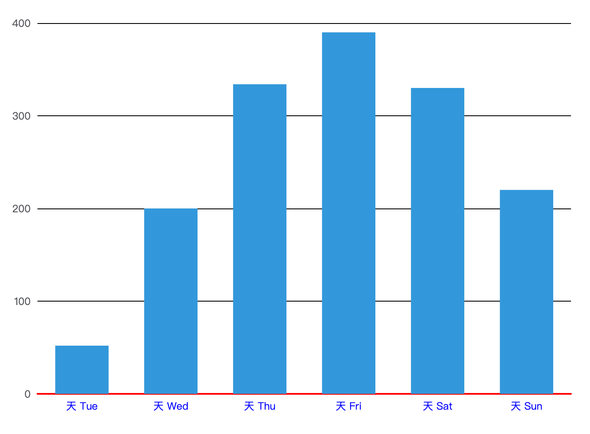

# xAxis


```ts
xAxis: {
  type: 'category',
  data: timeArray,
  axisLabel: { color: placeholderColor },
  axisLine: {
    lineStyle: {
      color: getChartListColor()[1],
      width: 1,
    },
  },
},

```


## type

坐标轴类型。

`category`：类目轴，`data` 必须是离散的类目数组（字符串或数值），适合柱状图/折线图按类目分组显示。

`value`：数值轴，适合连续数值（Y轴常用）。

`time`：时间轴，ECharts 会对时间自动做刻度/格式化，`data` 可以是时间字符串/时间戳/Date。


## name

坐标轴名称。类似于标题

## nameLocation

坐标轴名称`name`显示位置。

默认：`end`，默认位置容易被遮挡，可以更改显示的位置

**可选：**

- `'start'`
- `'middle'` 或者 `'center'`
- `'end'`

**可选：**

- `'start'`
- `'middle'` 或者 `'center'`
- `'end'`

## data

类目数据.`Array`

:::warning

data仅在`type=category`时生效

:::

如果设置了 [type](https://echarts.apache.org/zh/option.html#xAxis.type) 是 `'category'`，但没有设置 `axis.data`，则 `axis.data` 的内容会自动从 [series.data](https://echarts.apache.org/zh/option.html#series.data) 中获取，这会比较方便。

```ts
// 所有类目名称列表
data: ['周一', '周二', '周三', '周四', '周五', '周六', '周日']
// 每一项也可以是具体的配置项，此时取配置项中的 `value` 为类目名
data: [{
    value: '周一',
    // 突出周一
    textStyle: {
        fontSize: 20,
        color: 'red'
    }
}, '周二', '周三', '周四', '周五', '周六', '周日']
```


## axisLabel

坐标轴刻度标签的相关设置。

### formatter

刻度标签的内容格式器，支持字符串模板和回调函数两种形式。

```ts
// 使用字符串模板，模板变量为刻度默认标签 {value}
formatter: '{value} kg'
// 使用函数模板，函数参数分别为刻度数值（类目），刻度的索引
formatter: function (value, index, extra?) {
    return value + 'kg';
}
```


## axisLine

坐标轴线

### lineStyle

```ts
      axisLine: {
        lineStyle: {
          color: 'black',
          width: 1,
        },
      },
```


## splitLine

坐标轴在 grid 区域中的分隔线。

### lineStyle

分隔线样式

```ts
      splitLine: {
        lineStyle: {
          color: borderColor,
        },
      },
```


## axisTick

坐标刻度


## position

x 轴的位置。

可选：

- `'top'`
- `'bottom'`

## min

坐标轴刻度最小值。

不设置时会自动计算最小值保证坐标轴刻度的均匀分布。

### **① number（数值轴 value / log）**

直接指定最小刻度，如：

```
xAxis: { min: 0 }
```

###  **② string（类目轴 category）**

可以写：

- 类目名称，例如 `'苹果'`	
- 类目序号（从 0 开始），也支持负数（从末尾倒数计数）

```
xAxis: { min: '星期三' }
xAxis: { min: 2 } // 第三个类目
xAxis: { min: -1 } // 最后一个类目
```

### **③ 时间类型（time）**

支持：

- 字符串 `'2024-04-09 13:00:00'`
- 时间戳 `1712667600000`
- JS Date 对象 `new Date(...)`

###  dataMin

此时取数据在该轴上的最小值作为最小刻度

## max

用法同`min`

## minInterval

最小间隔，例如y轴的值只可能是整数：

```ts
yAxis: {
  type: 'value',
  minInterval: 1
}
```


## Example

```ts
option = {
  color: ['#3398DB'],
  tooltip: {
    trigger: 'axis',
    axisPointer: {
      type: 'shadow'
    }
  },
  grid: {},
  xAxis: [
    {
      type: 'category',
      min:1,
      name:'星期',
      nameLocation:'middle',
      axisLabel: {
        color: 'blue',
        formatter: '天 {value}'
      },
      axisLine: {
        lineStyle: {
          color: 'red',
          width: 2
        }
      },
      data: ['Mon', 'Tue', 'Wed', 'Thu', 'Fri', 'Sat', 'Sun']
    }
  ],
  yAxis: [
    {
      type: 'value',
      name:'数量',
      nameLocation:'middle',
      splitLine:{
        lineStyle:{
          color:'black'
        }
      }
    }
  ],
  series: [
    {
      name: '直接访问',
      type: 'bar',
      barWidth: '60%',
      data: [10, 52, 200, 334, 390, 330, 220]
    }
  ]
};

```

