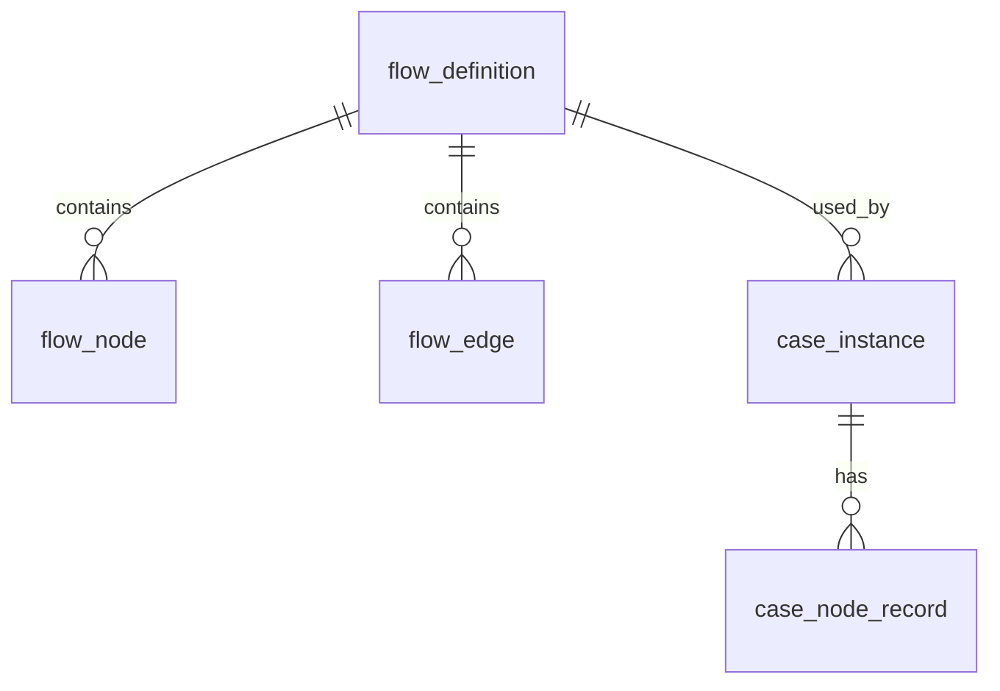

# 流程引擎




| 模块             | 作用                 |
| ---------------- | -------------------- |
| flow_definition  | 流程定义             |
| flow_node        | 节点定义             |
| flow_edge        | 节点连线             |
| case_instance    | 案件实例             |
| case_node_record | 案件节点记录（历史） |

## flow_definition

```sql
create table flow_definition
(
    id          bigint auto_increment
        primary key,
    definition_key varchar(128)  not null,
    definition_name        varchar(128)                       not null,
    description varchar(512)                       null,
    status      tinyint  default 1                 null comment '1-启用 0-禁用',
);

```

| id   | flow_code | flow_name |
| ---- | --------- | --------- |
| 1    | CASE_FLOW | 案件流程  |

## flow_node

```java
CREATE TABLE flow_node (
    id BIGINT PRIMARY KEY AUTO_INCREMENT,

    flow_id BIGINT,

    node_code VARCHAR(50),

    node_name VARCHAR(100),

    node_type VARCHAR(20)
);
```

node_type：

- START
- TASK
- CONDITION
- END

| node_code | node_name | type      |
| --------- | --------- | --------- |
| START     | 开始      | START     |
| CHECK     | 判断条件  | CONDITION |
| OP1       | 执行操作1 | TASK      |
| OP2       | 执行操作2 | TASK      |
| END       | 结束      | END       |

### form_config

当前节点的动态表单。

```json
{
  "fields": [
    {
      "key": "name",
      "type": "text",
      "label": "姓名"
    }
  ]
}
```


## flow_edge

```java
CREATE TABLE flow_edge (
    id BIGINT PRIMARY KEY AUTO_INCREMENT,

    flow_id BIGINT,

    from_node VARCHAR(50),

    to_node VARCHAR(50),

    condition_expression VARCHAR(200)
);
```

| from  | to    | condition       |
| ----- | ----- | --------------- |
| START | CHECK | null            |
| CHECK | OP1   | result == true  |
| CHECK | OP2   | result == false |
| OP1   | END   | null            |
| OP2   | END   | null            |

## flow_instance

```java
CREATE TABLE case_instance (
    id BIGINT PRIMARY KEY AUTO_INCREMENT,

    case_no VARCHAR(50),

    flow_id BIGINT,//flow_definition

    current_node VARCHAR(50),//flow_node

    status VARCHAR(20)
);
```

| case_no | current_node |
| ------- | ------------ |
| A001    | CHECK        |

## flow_instance_record

```java
CREATE TABLE case_node_record (
    id BIGINT PRIMARY KEY AUTO_INCREMENT,

    case_id BIGINT,

    node_code VARCHAR(50),

    action VARCHAR(20),

    operator_name VARCHAR(50),

    create_time DATETIME
);
```

### form_data

```json
{"name": "张三"}
```

