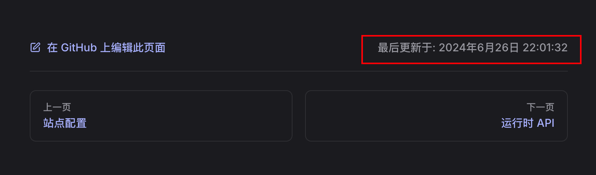
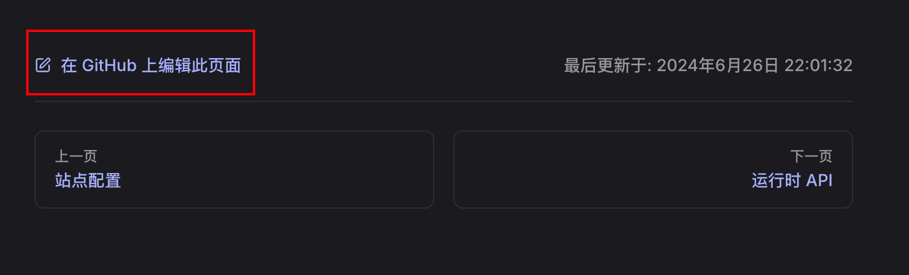

# frontmatter


## 定义

VitePress 支持在所有 Markdown 文件中使用 YAML frontmatter，并使用 [gray-matter](https://github.com/jonschlinkert/gray-matter) 解析。frontmatter 必须位于 Markdown 文件的顶部 (在任何元素之前，包括 `<script>` 标签)，并且需要在三条虚线之间采用有效的 YAML 格式。例如：

```md
---
title: Docs with VitePress
editLink: true
---
```


## 访问 frontmatter 数据

可以通过 Vue 表达式中的 `$frontmatter` 全局变量访问 frontmatter 数据：

```
---
title: Docs with VitePress
editLink: true
---

# {{ $frontmatter.title }}

Guide content
```

还可以使用 [`useData()`](https://vitepress.dev/zh/reference/runtime-api#usedata) 辅助函数在 `<script setup>` 中访问当前页面的 frontmatter。

## title

- 类型：`string`
- 默认值：站点级配置 [config.title](https://vitepress.dev/zh/reference/site-config#title) 


页面的标题。

```yaml
---
title: hello
---
```

## titleTemplate

- 类型：`string | boolean`
- 默认值：站点级配置 [config.titleTemplate](https://vitepress.dev/zh/reference/site-config#titletemplate)

标题的后缀。


```yaml
---
title: hello
titleTemplate: 标题后缀
---
```

## description

- 类型：`string`
- 默认值：站点级配置 [config.description](https://vitepress.dev/zh/reference/site-config#description) 

页面的描述。

```
---
description: VitePress
---
```

::: tip TODO

暂时还没有找到在哪里表现

:::

## 默认主题配置

以下 frontmatter 选项仅在使用默认主题时适用。

### layout

- 类型：`doc | home | page`
- 默认值：`doc`

指定页面的布局。

- `doc`——默认的文档布局（三栏）。
- `home`——“主页”的特殊布局。可以添加额外的选项，例如 `hero` 和 `features`。
- `page`——表现类似于 `doc`，但它不对内容应用任何样式。当想创建一个完全自定义的页面时很有用。


```md [index.md]
---
# https://vitepress.dev/reference/default-theme-home-page
layout: home

hero:
  name: "赖的知识库"
  text: "A VitePress Site"
  tagline: My great project tagline
  image:
    src: /bgc.png
  actions:
    - theme: brand
      text: markdown扩展
      link: /vitepress/markdown扩展
    - theme: alt
      text: markdown基础
      link: /vitepress/markdown基础

features:
  - title: Feature A
    details: Lorem ipsum dolor sit amet, consectetur adipiscing elit
  - title: Feature B
    details: Lorem ipsum dolor sit amet, consectetur adipiscing elit
  - title: Feature C
    details: Lorem ipsum dolor sit amet, consectetur adipiscing elit
---

```

### hero

only home

hero相关配置

### features

only home

features相关配置

### navbar

- 类型：`boolean`
- 默认值：`true`

是否显示[导航栏](https://vitepress.dev/zh/reference/default-theme-nav)。

### sidebar

- 类型：`boolean`
- 默认值：`true`

是否显示 [侧边栏](https://vitepress.dev/zh/reference/default-theme-sidebar).

### aside

- 类型：`boolean | 'left'`
- 默认值：`true`

定义侧边栏组件在 `doc` 布局中的位置。

  `false`： 可禁用侧边栏容器。
  `true` ：会将侧边栏渲染到右侧。
  `left` ：会将侧边栏渲染到左侧。

### outline

- 类型：`number | [number, number] | 'deep' | false`
- 默认值：`2`

大纲（右侧目录）中显示的标题级别。它与 [config.themeConfig.outline.level](https://vitepress.dev/zh/reference/default-theme-config#outline) 相同，它会覆盖站点级的配置。

### lastUpdated



- 类型：`boolean | Date`
- 默认值：`true`

是否在当前页面的页脚中显示[最后更新时间](https://vitepress.dev/zh/reference/default-theme-last-updated)的文本。如果指定了日期时间，则会显示该日期时间而不是上次 git 修改的时间戳。

### editLink



- 类型：`boolean`
- 默认值：`true`

是否在当前页的页脚显示[编辑链接](https://vitepress.dev/zh/reference/default-theme-edit-link)。

### footer

- 类型：`boolean`
- 默认值：`true`

是否显示[页脚](https://vitepress.dev/zh/reference/default-theme-footer)。

### pageClass

- 类型：`string`

将额外的类名称添加到特定页面。


```
---
pageClass: custom-page-class
---
```

然后可以在 `.vitepress/theme/custom.css` 文件中自定义该特定页面的样式：


```
.custom-page-class {
  /* 特定页面的样式 */
}
```
